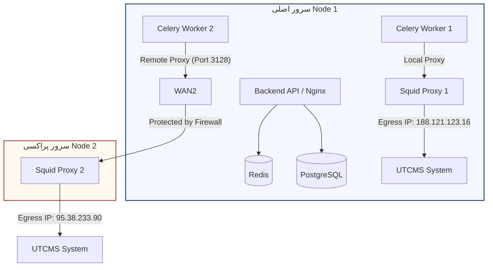

# راهنمای استقرار سیستم BarPro در محیط عملیاتی (معماری مبتنی بر ۲ سرور ابری)

این سند راهنمای گام‌به‌گام برای استقرار، مدیریت و بروزرسانی سیستم اتوماسیون **BarPro** بر روی دو سرور ابری (ابرک) تهیه‌شده در ابر آروان با مشخصات زیر است:

*   **سرور اصلی (Node 1):**
    *   آی‌پی اینترنتی: `188.121.123.16`
    *   سخت‌افزار: 4 vCPU - 12 GB RAM
    *   وظیفه: اجرای پایگاه داده، ردیس، بک‌اند، فرانت‌اند، ورکر شماره ۱، ورکر شماره ۲ و سرویس‌های کمکی.
*   **سرور کمکی/پروکسی (Node 2):**
    *   آی‌پی اینترنتی: `95.38.233.90`
    *   سخت‌افزار: 4 vCPU - 12 GB RAM
    *   وظیفه: اجرای پراکسی خروجی Squid 2 (ترافیک ورکر شماره ۲ از این سرور خارج می‌شود تا سیستم هدف درخواست‌ها را با آی‌پی این سرور ببیند).

---

## 🗺️ نمای کلی معماری ارتباطات



---

## 🔒 امنیت و ایزوله‌سازی پورت‌ها (جدید)
در راستای افزایش امنیت پروژه در محیط عملیاتی:
- پورت‌های حساس پایگاه‌داده PostgreSQL (`5432`) و Redis (`6379`) به طور کامل روی شبکه عمومی اینترنت بسته شده‌اند و فقط داخل شبکه داخلی داکر (Bridge network) قابل دسترسی هستند.
- فقط پورت‌های استاندارد وب (`80` و `443` در صورت نیاز) و پورت مانیتورینگ Prometheus (`9090`) روی سطح وب عمومی در دسترس قرار دارند.

---

## 🔒 مرحله ۱: تنظیمات فایروال و امنیت در پنل ابر آروان

برای جلوگیری از سوءاستفاده از پراکسی سرور کمکی، باید پورت `3128` سرور دوم را **فقط و فقط** به روی آی‌پی سرور اول باز کنید.

1.  وارد پنل ابر آروان شوید.
2.  به بخش **سرور ابری** > **گروه‌های فایروال** (arDefault یا گروه اختصاصی) بروید.
3.  برای **سرور دوم (Node 2 - 95.38.233.90)** یک قانون ورودی (Inbound Rule) به شکل زیر اضافه کنید:
    *   **نوع پروتکل:** TCP
    *   **پورت:** `3128`
    *   **آدرس منبع (Source IP):** `188.121.123.16` (آی‌پی سرور اصلی)
    *   **عملیات:** Allow (مجاز)
4.  سایر درخواست‌ها به این پورت از اینترنت باید مسدود (Deny) باشند.

---

## 🛠️ مرحله ۲: آماده‌سازی سرور دوم (Node 2 - `95.38.233.90`)

بر روی سرور دوم فقط کافیست سرویس پراکسی Squid را با داکر بالا بیاورید.

1.  وارد سرور دوم شوید (از طریق SSH).
2.  داکر را نصب کنید (در صورت عدم نصب):
    ```bash
    sudo apt update
    sudo apt install -y docker.io docker-compose-v2
    ```
3.  یک پوشه برای تنظیمات پراکسی بسازید:
    ```bash
    mkdir -p /opt/squid
    cd /opt/squid
    ```
4.  فایل `squid.conf` را بسازید:
    ```bash
    nano squid.conf
    ```
    محتوای زیر را درون آن قرار دهید (آی‌پی سرور اول برای دسترسی مجاز تعریف شده است):
    ```squid
    # Squid Proxy Configuration on Node 2
    http_port 3128

    # Access Control List (ACL)
    # اجازه دسترسی فقط به آی‌پی سرور اصلی
    acl server1 src 188.121.123.16
    
    http_access allow server1
    http_access allow localhost
    http_access deny all

    # تنظیم آی‌پی خروجی سرور دوم
    tcp_outgoing_address 95.38.233.90

    # غیرفعال کردن کش
    cache deny all
    ```
5.  فایل `docker-compose.yml` را بسازید:
    ```bash
    nano docker-compose.yml
    ```
    محتوای زیر را درون آن قرار دهید:
    ```yaml
    version: '3.8'

    services:
      squid:
        image: ubuntu/squid:latest
        container_name: remote_squid
        restart: unless-stopped
        volumes:
          - ./squid.conf:/etc/squid/squid.conf:ro
        ports:
          - "3128:3128"
    ```
6.  سرویس پراکسی را اجرا کنید:
    ```bash
    sudo docker compose up -d
    ```

---

## 🚀 مرحله ۳: آماده‌سازی و اجرای سرور اصلی (Node 1 - `188.121.123.16`)

1.  وارد سرور اصلی شوید.
2.  آخرین نسخه ابزار Docker Compose V2 را بر روی سیستم نصب کنید:
    ```bash
    sudo apt update
    sudo apt install -y docker-compose-v2
    ```
3.  کد پروژه را در مسیر `/opt/barpro` کلون یا آپلود کنید.
4.  فایل تنظیمات محیطی `.env` را بر اساس نمونه `.env.example` پیکربندی کنید.
5.  فایل پراکسی محلی سرور اول `infra/squid/squid_1.conf` را ویرایش کرده و آی‌پی سرور اول را در فیلد `tcp_outgoing_address` جایگزین کنید.
6.  بهینه‌سازی حجم بیلد (جدید):
    به منظور تسریع چشمگیر زمان انتقال فایل‌ها به داکر کانتینر، فایل‌های `.dockerignore` در پروژه تعبیه شده‌اند که از انتقال پوشه‌های سنگین نظیر `node_modules` جلوگیری کرده و سرعت بیلد داکر را از چند دقیقه به کمتر از ۱ ثانیه می‌رساند.

---

## 🛠️ مرحله ۴: اسکریپت مدیریت هوشمند و دیپلوی (`manage.sh`) (جدید)

برای ساده‌سازی فرآیندهای مدیریت، عیب‌یابی و آپدیت پروژه، یک اسکریپت متمرکز به نام `manage.sh` در ریشه پروژه قرار گرفته است.

### راه‌اندازی گیت روی سرور
برای اتصال مستقیم سرور به مخزن گیت‌هاب و دیپلوی خودکار تغییرات جدید:
```bash
cd /opt/barpro
bash manage.sh git-setup
```

### عملیات‌های متداول با `manage.sh`

| دستور | شرح عملکرد |
| :--- | :--- |
| `bash manage.sh status` | نمایش وضعیت زنده تمام کانتینرها، مصرف دیسک و مصرف RAM سرور. |
| `bash manage.sh health` | تست خودکار سلامت اتصالات فرانت‌اند، API بک‌اند، دیتابیس و ردیس. |
| `bash manage.sh logs [service]` | مشاهده زنده لاگ‌های کل پروژه یا یک کانتینر خاص (مثلاً: `backend`). |
| `bash manage.sh deploy` | **دریافت خودکار کدهای جدید از گیت‌هاب و بیلد و ری‌استارت هوشمند بخش‌های تغییریافته.** |
| `bash manage.sh update-ui` | بیلد سریع Next.js و آپدیت خودکار فرانت‌اند بدون تأثیرگذاری روی دیتابیس یا بک‌اند. |
| `bash manage.sh update-api` | آپدیت کدهای بک‌اند، ورکرها و اجرای خودکار مایگریشن‌های دیتابیس (Alembic). |
| `bash manage.sh backup-db` | تهیه نسخه پشتیبان از پایگاه داده با حجم فشرده شده در مسیر `output/backups/`. |
| `bash manage.sh restore-db <file>` | بازنشانی پایگاه داده از روی یک فایل پشتیبان دلخواه. |
| `bash manage.sh start` / `stop` | شروع یا توقف کل سرویس‌های پروژه به صورت امن بدون از دست رفتن داده‌ها. |

---

## 💾 مرحله ۵: راه‌اندازی نسخه‌های پشتیبان روزانه (Google Drive Backups)

برای بکاپ‌گیری منظم و ارسال مستقیم فایل‌ها به گوگل درایو:

1.  ابزار `rclone` را روی سرور اصلی نصب کنید:
    ```bash
    sudo apt update
    sudo apt install -y rclone
    ```
2.  پیکربندی اتصال گوگل درایو با نام `gdrive`:
    ```bash
    rclone config
    ```
    *   گزینه `n` (New remote) را وارد کنید.
    *   نام آن را `gdrive` بگذارید.
    *   نوع فضای ذخیره‌سازی را `drive` (Google Drive) انتخاب کنید.
    *   سایر فیلدها را با مقادیر پیش‌فرض رد کرده و مراحل احراز هویت را در مرورگر سیستم خود تکمیل کنید تا مجوزهای دسترسی داده شود.
3.  تنظیم اسکریپت بکاپ در cron جهت اجرای هر روز راس ساعت ۳ صبح:
    ```bash
    crontab -e
    ```
    خط زیر را به انتهای فایل اضافه کنید:
    ```cron
    0 3 * * * /opt/barpro/scripts/db_backup.sh >> /opt/barpro/output/backups.log 2>&1
    ```
4.  فایل اسکریپت بک‌آپ را قابل‌اجرا کنید:
    ```bash
    chmod +x /opt/barpro/scripts/db_backup.sh
    ```

---

## 📊 مرحله ۶: راه‌اندازی مانیتورینگ و هشدارهای تلگرام

برای دریافت لحظه‌ای وضعیت قطع شدن موقت آی‌پی‌ها (توسط Circuit Breaker) یا پر شدن رم سرور:

1.  وابستگی‌های پایتون مانیتورینگ را نصب کنید:
    ```bash
    pip3 install redis psutil
    ```
2.  برای اجرای مانیطور به‌صورت یک پس‌زمینه (Background Daemon) دائمی:
    ```bash
    nohup python3 /opt/barpro/scripts/monitor_alerts.py > /opt/barpro/output/monitor.log 2>&1 &
    ```
    همچنین می‌توانید آن را به عنوان یک سیستم‌سرویس (`systemd`) ثبت کنید تا با ری‌استارت شدن سرور مجدداً بالا بیاید.
