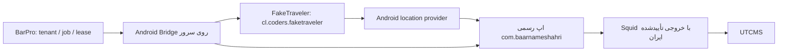

# طرح جایگزینی GPS با FakeTraveler روی Android سروری

تاریخ: ۲۰۲۶-۰۹-۱۵. دامنه بنا به تصریح کاربر: **Android مجازی روی سرور Linux؛
بدون گوشی فیزیکی. FakeTraveler جایگزین روش فعلی اجرای GPS می‌شود.**

این طرح، نسخهٔ اصلاح‌شدهٔ پیش‌نویس Antigravity است. فایل هم‌نام موجود در
Downloads دربارهٔ SMS/OTP بود و مبنای این کار نیست. ارزیابی شواهد، تعارض‌ها و
محدودیت تست در [گزارش ممیزی](ANDROID_CLIENT_REVIEW.md) ثبت شده است.

## معماری هدف و وضعیت فعلی



FakeTraveler، Redroid یا اپ رسمی را جایگزین نمی‌کند؛ تأمین‌کنندهٔ موقعیت است.
بارپرو احراز هویت کاربر، مالکیت tenant/driver/job، زمان‌بندی، قفل و نتیجهٔ سفر
را نگه می‌دارد. UI اپ رسمی عملیات حمل را اجرا می‌کند. مسیر فعلی
`app/api/routes/shipping_gps.py` هنوز HTTP است و **مبنای مهاجرت** محسوب می‌شود.
سوییچ runtime، خودکارسازی کامل UI و استقرار Redroid هنوز انجام نشده‌اند.

Bridge آغازشده در `app/android_bridge/` عمداً وابستگی import به API، DB و
مدل‌های ML ندارد تا روی میزبان Android با Python مستقل اجرا شود. در این مرحله
تنها مشاهده و preflight فراهم است؛ هیچ API عمومی برای arbitrary ADB/shell ندارد.

## قرارداد واقعی FakeTraveler

منبع: `Fake-GPS/FakeTraveler/app/build.gradle` و `app/src/main/AndroidManifest.xml`.

- package: `cl.coders.faketraveler`؛ activity: `cl.coders.faketraveler.MainActivity`.
- ورودی پیاده‌شده: Intent از نوع `android.intent.action.VIEW` با URI `geo:`.
  `MainActivity.applyIntentOrDefault()` مختصات را در فرم می‌گذارد. ورود URI به
  معنی شروع provider نیست؛ `applyLocation()` از دکمهٔ Apply اجرا می‌شود.
- سرویس `.MockedLocationService`، `exported=false` است. در سورس بررسی‌شده
  receiver برای `org.woheller69.mocklocation.UPDATE_LOCATION` وجود ندارد.
- در فاز بعد از UI موجود با read-back استفاده شود یا کنترل‌گر محدود و
  احرازشده‌ای در پروژهٔ FakeTraveler طراحی شود؛ broadcast فرضی جای آن را نمی‌گیرد.
- دکمهٔ `button_applyStop` بین Apply و Stop تغییر نقش می‌دهد. تکرار کورکورانهٔ
  کلیک می‌تواند provider را خاموش کند. هر فرمان باید نقش فعلی دکمه، session
  سرویس، مختصات و نتیجه را بازخوانی کند.
- داده‌ها باید `provider=faketraveler`، شناسهٔ instance/session، زمان مشاهده و
  منبع مجازی را حفظ کنند. مشاهده در provider با اندازه‌گیری GPS فیزیکی برابر نیست.

## مرحلهٔ پیاده‌شده: observation سمت سرور

- [x] تنظیم opt-in، serial اجباری و timeout محدود؛ متغیرها در `.env.example`.
- [x] هر ADB command با `-s` و هر layout با `--device` همان instance اجرا می‌شود.
- [x] بررسی اتصال، boot، نصب اپ رسمی **و FakeTraveler**، SDK/ABI، اندازه و density
  مؤثر نمایشگر و تطابق دقیق global HTTP proxy.
- [x] خواندن `android layout --flat` با رد schema نامعتبر، تطبیق دقیق و یکتای
  selector؛ رد عنصر غایب، مبهم، غیرفعال یا خارج صفحه طبق دادهٔ مشاهده‌شده.
- [x] subprocess بدون shell، سقف خروجی، cleanup در timeout/cancel و خطای بدون
  stdout/stderr حساس. CLI فقط summary می‌دهد؛ متن UI چاپ نمی‌شود.
- [x] تست‌های Bridge و تست واقعی handlerهای حمل با transport/storage ایزوله.

Observation فقط شاهد لحظه‌ای است. نصب package، وجود accessibility node و تنظیم
proxy به‌تنهایی signature، foreground، account identity، نبود overlay، آمادگی
JavaScript، اعمال GPS یا رسیدن ترافیک به UTCMS را ثابت نمی‌کنند. خروجی همیشه
`egress_verified=false` و `submission_ready=false` دارد. خروجی `observed` مجوز
اجرای shipment نیست. `layout` ممکن است helper خود Android CLI را روی instance
راه‌اندازی کند؛ روی نمونهٔ اختصاصی آزمایش اجرا شود.

## مراحل باقی‌مانده و معیار پذیرش

### میزبان و image

- [ ] میزبان Linux ایزوله، image دقیق Redroid با digest، نسخهٔ Android، root
  integration و renderer انتخاب شوند؛ استفاده از `latest` به‌عنوان نسخهٔ اثبات‌شده ممنوع.
- [ ] binder/binderfs و capability/device access حداقلی با boot واقعی اثبات شوند.
  دستور نمونهٔ `privileged: true` پیش‌نویس با `CRITICAL_RULES.md` سازگار نیست؛
  Compose ظاهراً قابل اجرا با دسترسی‌های حدسی تولید نشود.
- [ ] ابتدا روی میزبان ایزوله قابلیت اجرا بدون privileged بررسی شود؛ اگر ممکن
  نبود، تغییر مشخص سیاست زیرساخت با tradeoff و دامنهٔ محدود لازم است، نه دورزدن قاعده.
- [ ] CPU/RSS، boot، crash/ANR، WebView و نرم‌افزار رندر در اندازه‌های نمایشگر
  منتخب اندازه‌گیری شوند. headless به معنی نبود display/SurfaceFlinger نیست.
- [ ] image و APKها با hash و امضای معلوم ثبت شوند. APK `release-unsigned` مستقیم
  نصب‌پذیر نیست. وجود `/data/adb/lspd` اثبات فعال بودن hook نیست و دستکاری مستقیم
  DB نسخه‌نامعلوم LSPosed قرارداد provisioning محسوب نمی‌شود.
- [ ] ADB فقط در شبکهٔ خصوصی یا loopback مدیریت‌شده؛ عدم دسترسی بیرونی جداگانه
  آزمون شود. هیچ credential راننده در command-line، logcat یا artifact عمومی ثبت نشود.

### شبکه

- [ ] DNS از داخل Android برای proxy قابل استفاده باشد؛ hostname شبکهٔ Docker
  الزاماً در netd اندروید resolve نمی‌شود. loopback اندروید همان loopback میزبان نیست.
- [ ] global HTTP proxy صرفاً تنظیم است. namespace/firewall باید خروج مستقیم،
  IPv6 و UDP/QUIC نامجاز را مسدود کند. Squid را در آزمایش قطع کنید: درخواست اپ
  باید شکست بخورد، نه اینکه مستقیم از سرور خارج شود.
- [ ] egress واقعی ترافیک اپ و GeoIP ایران، TLS و پاسخ هر endpoint ثبت شود.
  `curl` روی host یا ipify بدون GeoIP و بدون تطبیق مسیر اپ، کافی نیست.
- [ ] خطای non-JSON با status/content-type و شاهد redacted طبقه‌بندی شود؛
  خود این خطا یا 408 عمومی اثبات تشخیص WAF نیست.

### UI و provider

- [ ] با نسخهٔ نصب‌شده، layout واقعی و screenshot بررسی و fixture پاک‌سازی‌شده
  ثبت شود؛ fixtureهای فعلی Bridge مصنوعی‌اند و سازگاری runtime را ثابت نمی‌کنند.
- [ ] readiness اپ رسمی و FakeTraveler، owner session، foreground، permission
  و role دکمهٔ Apply/Stop قبل از عمل بررسی شوند.
- [ ] مختصات ورودی → provider → آنچه اپ رسمی می‌خواند، read-back یکسان با timestamp
  تازه داشته باشد. مسیر محاسبه‌شدهٔ BarPro صرفاً برنامه است تا شاهد Android ثبت شود.
- [ ] RTL، keyboard overlay، تغییر اندازه/density، چرخش، WebView و UI پویای
  React Native در dry-run آزمایش شوند. نبود accessibility موجب توقف است، نه tap حدسی.
- [ ] سلامت hook در cold start، پس از restart و در برابر تغییر نسخه بررسی شود؛
  ادعای خنثی‌شدن همهٔ detectorها از روی compile یا log «installed» پذیرفته نیست.

### جایگزینی مسیر حمل

- [ ] adapter واقعی Android با قرارداد command/result محدود به عملیات مشخص
  اضافه شود؛ مرز tenant/driver/job و lease باید پیش از دسترسی به instance بررسی شود.
- [ ] مالکیت و قفل روی Android instance نیز برقرار باشد؛ چند راننده نباید
  session، مکان یا credential یک instance را هم‌زمان مصرف کنند.
- [ ] mode اجرایی در وضعیت پایدار job ثبت شود. قبل از mutation، intent و fence
  پایدار ثبت گردد؛ پس از timeout یا crash، همان action تکرار نشود و به HTTP fallback نکند.
- [ ] شروع/پایان از UI رسمی و سپس read-back وضعیت در UTCMS انجام شود. نتیجهٔ
  نامعلوم → reconciliation/needs_review؛ ADB exit code یا بسته‌شدن modal موفقیت نیست.
- [ ] بعد از dry-run نسخهٔ دقیق و بررسی ثبت مجازی بودن منبع موقعیت، مهاجرت هر
  tenant کنترل‌شده انجام شود. هیچ مسیر تولیدی با fixture یا موقعیت برنامه‌ریزی‌شده
  به‌عنوان GPS اندازه‌گیری‌شده علامت‌گذاری نشود.

## اجرای ابزار observation روی سرور Android

این دستورات برای **instance از قبل provision‌شدهٔ Redroid** هستند و provisioning
انجام نمی‌دهند. shell محیط سرویس باید متغیرهای زیر را دریافت کند؛ CLI فایل `.env`
را خودکار load نمی‌کند. serial و آدرس proxy نمونه‌اند و باید با runtime تطبیق یابند.

```bash
export ANDROID_BRIDGE_ENABLED=true
export ANDROID_BRIDGE_SERIAL=127.0.0.1:5555
export ANDROID_BRIDGE_EXPECTED_PROXY=squid:3128
export ANDROID_BRIDGE_ADB_BINARY=adb
export ANDROID_BRIDGE_ANDROID_BINARY=android
python3 -m app.android_bridge
python3 -m app.android_bridge --layout
```

Bridge اتصال خودکار `adb connect` نمی‌زند و instance دلخواه انتخاب نمی‌کند؛ اتصال
مدیریت‌شده از قبل باید با همان serial موجود باشد. exit 0 فقط یعنی observation
جمع شد؛ exit 2 یعنی غیرفعال، configuration نامعتبر یا شاهد ناکافی. بدون متغیرها:

```json
{"status":"unavailable","reason":"bridge_disabled","execution_authorized":false}
```

مرجع رسمی UI: [UI Automator](https://developer.android.com/training/testing/other-components/ui-automator).
با `android docs search` و `android docs fetch` در همین بررسی خوانده شد؛ انتظار
شرطی و selector مشخص جای sleep/tap ثابت را می‌گیرند. پایداری accessibility نیز
به‌تنهایی به معنی idle بودن تمام پردازش‌های برنامه نیست.
