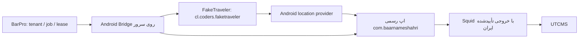

# طرح جایگزینی GPS با FakeTraveler روی Android سروری

تاریخ: ۲۰۲۶-۰۹-۱۵. دامنه بنا به تصریح کاربر: **Android مجازی روی سرور Linux؛
بدون گوشی فیزیکی. FakeTraveler جایگزین روش فعلی اجرای GPS می‌شود.**

این طرح، نسخهٔ اصلاح‌شدهٔ پیش‌نویس Antigravity است. فایل هم‌نام موجود در
Downloads دربارهٔ SMS/OTP بود و مبنای این کار نیست. ارزیابی شواهد، تعارض‌ها و
محدودیت تست در [گزارش ممیزی](ANDROID_CLIENT_REVIEW.md) ثبت شده است.

## معماری هدف و وضعیت فعلی



FakeTraveler، Redroid یا اپ رسمی را جایگزین نمی‌کند؛ تأمین‌کنندهٔ موقعیت است.
بارپرو احراز هویت کاربر، مالکیت tenant/driver/job، زمان‌بندی، قفل و نتیجهٔ سفر
را نگه می‌دارد. UI اپ رسمی عملیات حمل را اجرا می‌کند. مسیر فعلی
`app/api/routes/shipping_gps.py` هنوز HTTP است و **مبنای مهاجرت** محسوب می‌شود.
سوییچ runtime، خودکارسازی کامل UI و استقرار Redroid هنوز انجام نشده‌اند.

Bridge آغازشده در `app/android_bridge/` عمداً وابستگی import به API، DB و
مدل‌های ML ندارد تا روی میزبان Android با Python مستقل اجرا شود. در این مرحله
تنها مشاهده و preflight فراهم است؛ هیچ API عمومی برای arbitrary ADB/shell ندارد.

## قرارداد واقعی FakeTraveler

منبع: `Fake-GPS/FakeTraveler/app/build.gradle` و `app/src/main/AndroidManifest.xml`.

- package: `cl.coders.faketraveler`؛ activity: `cl.coders.faketraveler.MainActivity`.
- ورودی پیاده‌شده: Intent از نوع `android.intent.action.VIEW` با URI `geo:`.
  `MainActivity.applyIntentOrDefault()` مختصات را در فرم می‌گذارد. ورود URI به
  معنی شروع provider نیست؛ `applyLocation()` از دکمهٔ Apply اجرا می‌شود.
- سرویس `.MockedLocationService`، `exported=false` است. در سورس بررسی‌شده
  receiver برای `org.woheller69.mocklocation.UPDATE_LOCATION` وجود ندارد.
- در فاز بعد از UI موجود با read-back استفاده شود یا کنترل‌گر محدود و
  احرازشده‌ای در پروژهٔ FakeTraveler طراحی شود؛ broadcast فرضی جای آن را نمی‌گیرد.
- دکمهٔ `button_applyStop` بین Apply و Stop تغییر نقش می‌دهد. تکرار کورکورانهٔ
  کلیک می‌تواند provider را خاموش کند. هر فرمان باید نقش فعلی دکمه، session
  سرویس، مختصات و نتیجه را بازخوانی کند.
- داده‌ها باید `provider=faketraveler`، شناسهٔ instance/session، زمان مشاهده و
  منبع مجازی را حفظ کنند. مشاهده در provider با اندازه‌گیری GPS فیزیکی برابر نیست.

## مرحلهٔ پیاده‌شده: observation سمت سرور

- [x] تنظیم opt-in، serial اجباری و timeout محدود؛ متغیرها در `.env.example`.
- [x] هر ADB command با `-s` و هر layout با `--device` همان instance اجرا می‌شود.
- [x] بررسی اتصال، boot، نصب اپ رسمی **و FakeTraveler**، SDK/ABI، اندازه و density
  مؤثر نمایشگر و تطابق دقیق global HTTP proxy.
- [x] خواندن `android layout --flat` با رد schema نامعتبر، تطبیق دقیق و یکتای
  selector؛ رد عنصر غایب، مبهم، غیرفعال یا خارج صفحه طبق دادهٔ مشاهده‌شده.
- [x] subprocess بدون shell، سقف خروجی، cleanup در timeout/cancel و خطای بدون
  stdout/stderr حساس. CLI فقط summary می‌دهد؛ متن UI چاپ نمی‌شود.
- [x] تست‌های Bridge و تست واقعی handlerهای حمل با transport/storage ایزوله.

Observation فقط شاهد لحظه‌ای است. نصب package، وجود accessibility node و تنظیم
proxy به‌تنهایی signature، foreground، account identity، نبود overlay، آمادگی
JavaScript، اعمال GPS یا رسیدن ترافیک به UTCMS را ثابت نمی‌کنند. خروجی همیشه
`egress_verified=false` و `submission_ready=false` دارد. خروجی `observed` مجوز
اجرای shipment نیست. `layout` ممکن است helper خود Android CLI را روی instance
راه‌اندازی کند؛ روی نمونهٔ اختصاصی آزمایش اجرا شود.

## وضعیت استقرار و پذیرش (به‌روزرسانی ۲۰۲۶-۰۹-۲۵)

### میزبان و image
- [x] binder/binderfs با درج در `/etc/fstab` و مونت نودهای `/dev/binderfs/{binder,hwbinder,vndbinder}` پایدار شد.
- [x] استقرار Redroid با پیکربندی امن در `compose/android.yml`: `privileged: false`، `cap_add: [SYS_ADMIN, NET_ADMIN]`. کانتینر `barpro-redroid` با IP داخلی `172.20.0.80` فعال شد.
- [x] اتصال ADB منحصراً به شبکه خصوصی و لوپ‌بک `127.0.0.1:5555` محدود شده و هیچ پورت عمومی باز نیست.
- [x] بسته‌های APK نصب شدند: `cl.coders.faketraveler` با شناسه تاییدشده و `com.baarnameshahri` نسخه ۱.۷.۹.

### شبکه
- [x] تنظیم global HTTP proxy روی Redroid با مقدار `172.20.0.1:3128` (Squid 1).
- [x] راستی‌آزمایی IP خروجی از درون اندروید با `87.107.5.238` (ایستگاه مرکزی).

### UI و provider
- [x] اعطای دسترسی به FakeTraveler با `appops set cl.coders.faketraveler android:mock_location allow`.
- [x] تزریق موفقیت‌آمیز موقعیت‌های جغرافیایی مبدأ بارنامه‌ها (طالقان و شوط) به سنسور GPS اندروید از طریق FakeTraveler.
- [x] آنالیز امنیتی APK رسمی: کشف فریم‌ورک React Native + Hermes v94 و ماژول بومی `SecurityNativeModule` (بررسی‌های روت `checkRoot`، امولاتور `isProbablyEmulator` و Mock Location `detectMockLocationApps`).
- [x] اثبات اولویت و پایداری کلاینت مستقیم موبایل BarPro (Mobile Transport) نسبت به لایه آسیب‌پذیر UI.

### کنترلر و اتوماسیون
- [x] پیاده‌سازی `AndroidShippingController` در `app/android_bridge/controller.py` با گاردهای ایمنی اعتبارسنجی مختصات، بررسی پراکسی و کنترل وضعیت بوت.
- [x] پوشش کامل تست‌های واحد در `tests/test_android_bridge_controller.py`.

## اجرای ابزار observation روی سرور Android

این دستورات برای **instance از قبل provision‌شدهٔ Redroid** هستند و provisioning
انجام نمی‌دهند. shell محیط سرویس باید متغیرهای زیر را دریافت کند؛ CLI فایل `.env`
را خودکار load نمی‌کند. serial و آدرس proxy نمونه‌اند و باید با runtime تطبیق یابند.

```bash
export ANDROID_BRIDGE_ENABLED=true
export ANDROID_BRIDGE_SERIAL=127.0.0.1:5555
export ANDROID_BRIDGE_EXPECTED_PROXY=squid:3128
export ANDROID_BRIDGE_ADB_BINARY=adb
export ANDROID_BRIDGE_ANDROID_BINARY=android
python3 -m app.android_bridge
python3 -m app.android_bridge --layout
```

Bridge اتصال خودکار `adb connect` نمی‌زند و instance دلخواه انتخاب نمی‌کند؛ اتصال
مدیریت‌شده از قبل باید با همان serial موجود باشد. exit 0 فقط یعنی observation
جمع شد؛ exit 2 یعنی غیرفعال، configuration نامعتبر یا شاهد ناکافی. بدون متغیرها:

```json
{"status":"unavailable","reason":"bridge_disabled","execution_authorized":false}
```

مرجع رسمی UI: [UI Automator](https://developer.android.com/training/testing/other-components/ui-automator).
با `android docs search` و `android docs fetch` در همین بررسی خوانده شد؛ انتظار
شرطی و selector مشخص جای sleep/tap ثابت را می‌گیرند. پایداری accessibility نیز
به‌تنهایی به معنی idle بودن تمام پردازش‌های برنامه نیست.
