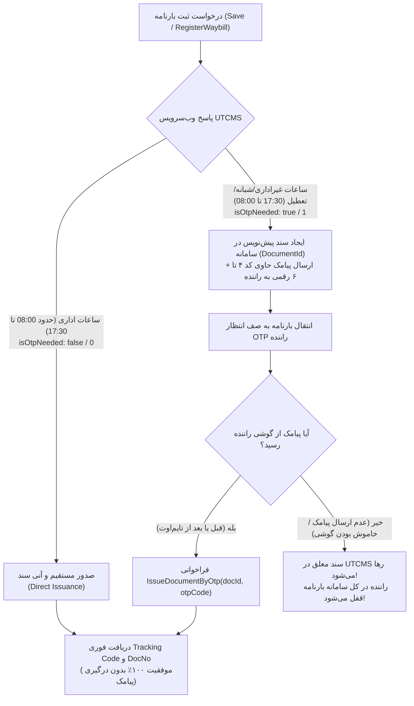
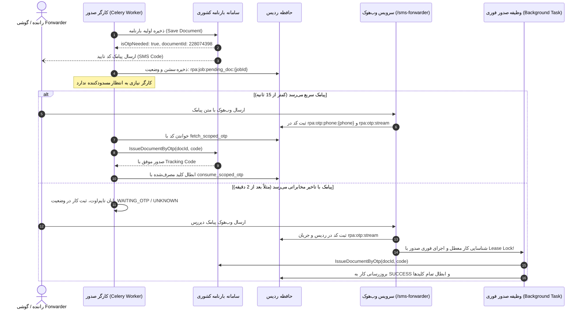

# کالبدشکافی عمیق و نقشه راه جامع: سیستم SMS Forwarder و چرخه OTP در BarPro

> **وضعیت سند:** تصویب‌شده و مستقر در کدبیس (`origin/otp-sms-forwarder`)  
> **دامنه شمول:** هسته ثبت بارنامه (`waybill_worker`, `waybill_job_service`)، موتور اتوماسیون (`waybill_bot_multitenant`, `waybill_enhanced`, `utcms_mobile_client`)، سرویس وب‌هوک و ردیس (`otp_delivery`, `otp_forwarder`, `otp_keys`, `otp_wakeup_consumer`) و تعامل با اپلیکیشن اندروید فورواردر  
> **تاریخ بازنگری و تأیید:** ۵ اکتبر ۲۰۲۶ (۱۴ مهر ۱۴۰۵)

---

## ۱. کالبدشکافی رفتار سامانه بارنامه کشوری (barname.utcms.ir)

### الف) رفتار دوگانه سامانه بر حسب ساعات شبانه‌روز

سامانه بارنامه شهرداری بر اساس سیاست‌های امنیتی سازمان شهرداری‌ها و دهیاری‌ها، رفتار متفاوتی در قبال بارنامه‌ها دارد:



#### ۱. ساعات اداری و روز (Daytime Window - 08:00 تا 17:30):
* **وضعیت:** در بیش از ۹۵٪ موارد، فیلد `isOtpNeeded: false` است.
* **جریان کاری:** بارنامه به صورت مستقیم شماره می‌گیرد و هیچ چالش پیامکی برای راننده ایجاد نمی‌شود.
* **گلوگاه پیشین:** در صورتی که در روز قبل یک بارنامه به دلیل پیامک شبانه قفل شده باشد، گیت سراسری `utcms_submission_gate` ممکن بود در وضعیت `OTP_REQUIRED` یا `UNKNOWN` باقی مانده و تمام بارنامه‌های روز را نیز مسدود نگه دارد. این رفتار اکنون با تفکیک مسیر موبایل و اعتبارسنجی پروب زنده مدیریت می‌شود.

#### ۲. ساعات شبانه و تعطیلات (Nighttime Window - 17:30 تا 08:00 صبح):
* **وضعیت:** سامانه پاسخ ذخیره اولیه را با `isOtpNeeded: true` و یک `documentId` موقت برمی‌گرداند و پیامک تایید را از طریق سرشماره‌های دولتی (معمولاً ۲۰۰۰۷۷۷۷ یا ۳۰۰۰۱۹۲۳) به شماره همراه راننده ارسال می‌کند.
* **گلوگاه‌های شناسایی‌شده در کدهای پیشین:**
  * در کارگر قدیمی سلری:
    ```python
    gate_state = await utcms_submission_gate.get_state()
    if gate_state.value != "otp_free" and not allow_otp_flow:
        # کار را فریز کرده و به وضعیت WAITING_SUBMISSION_WINDOW می‌برد تا ساعت 08:00 فردا صبح!
    ```
  * فایل `app/services/night_submission_policy.py`: بارنامه‌ها را برای ساعت ۸ صبح روز بعد زمان‌بندی مجدد می‌کرد.
  * **راهکار مدرن:** با فعال‌سازی پرچم `allow_otp_flow=true` یا حالت `transport=mobile`، سیستم سند پیش‌نویس تشکیل داده و به شکل رویدادمحور با دریافت وب‌هوک SMS Forwarder سند را در لحظه صادر می‌کند.

---

## ۲. بررسی دقیق زمان‌بندی و مکانیزم انتساب پیامک به راننده

### الف) آناتومی پیامک ارسالی سامانه UTCMS و چالش تفکیک

متن واقعی ارسالی از سرشماره‌های ۲۰۰۰۷۷۷۷ یا ۳۰۰۰۱۹۲۳ در شبکه مخابراتی ایران:
> *«کد تایید صدور بارنامه شهرداری: ۴۸۱۹۰۲»*  
> یا  
> *«کد تایید شما در سامانه حمل بار شهری: ۶۵۴۳۲۱»*

**حقایق فنی پیامک:**
1. در متن پیامک، **هیچ نامی از راننده، شماره تلفن راننده، پلاک کامیون، کد ملی یا شماره بارنامه وجود ندارد.**
2. اگر ۱۰ راننده به طور همزمان در یک شرکت باربری بارنامه ثبت کنند، ۱۰ پیامک با متن کاملاً مشابه وارد می‌شود.

### ب) تحلیل ۳ سناریوی عملیاتی در حمل و نقل ایران

```
┌────────────────────────────────────────────────────────────────────────────────────────┐
│ سناریوی ۱: هر راننده روی گوشی اندروید شخصی خود اپلیکیشن Forwarder دارد                  │
│ چالش ایران: سیم‌کارت‌های ایرانسل/همراه اول شماره سیم‌کارت را روی چیپ ذخیره نمی‌کنند.    │
│ اپلیکیشن فورواردر نمی‌تواند شماره راننده را خودکار تشخیص دهد.                          │
│ الزام: شماره موبایل راننده باید به صورت دستی در Template وب‌هوک گوشی هاردکد شود.        │
├────────────────────────────────────────────────────────────────────────────────────────┤
│ سناریوی ۲: شرکت باربری یک گوشی یا مودم GSM مرکزی در دفتر دارد                          │
│ سیم‌کارت تمام رانندگان روی یک گوشی/مودم رله متمرکز است.                                │
│ چالش: پیامک‌ها با یک شماره وارد می‌شوند.                                                │
│ راهکار: انتساب زمانی تک‌پرواز (Single-Flight Job Attribution) در سطح شرکت.             │
├────────────────────────────────────────────────────────────────────────────────────────┤
│ سناریوی ۳: پیامک با تاخیر می‌رسد (دکل‌های مخابراتی در شب دچار ترافیک هستند)          │
│ چالش: کارگر سلری بعد از ۱۲۰ ثانیه خسته شده و کار را به UNKNOWN می‌برد.                  │
│ پیامک در ثانیه ۱۲۵ می‌رسد و می‌سوزد!                                                   │
│ راهکار: معماری رویدادمحور و بیدارسازی سند معلق (Event-Driven Wakeup).                 │
└────────────────────────────────────────────────────────────────────────────────────────┘
```

### ج) مکانیزم انتساب در BarPro و حل چالش‌ها

1. **انتساب بر مبنای کلید موبایل راننده (`rpa:otp:phone:09xxxxxxxxx`):**
   * بارپرو شماره راننده را از بارنامه (`payload["vehicle"]["driver_mobile"]`) یا مدل `Driver.phone` می‌داند.
   * وب‌هوک شماره موبایل راننده را دریافت کرده و در این کلید ذخیره می‌کند.
2. **انتساب هوشمند تک‌بارنامه معلق (Fallback for Shared Gateways):**
   * اگر اپلیکیشن فورواردر شماره راننده را نفرستاد (یا شماره شرکت را فرستاد)، به جای بازگرداندن خطای ۴۲۲ و دور انداختن پیامک، سرور بررسی می‌کند:
   * *«آیا در حال حاضر در این شرکت/سیستم فقط یک بارنامه در انتظار کد OTP است؟»*
   * اگر دقیقاً یک بارنامه معطل باشد، پیامک به صورت قطعی به همان بارنامه اختصاص می‌یابد.
   * **گارد صریح ابهام (`AMBIGUOUS_OTP`):** اگر بیش از یک بارنامه در انتظار باشد، سیستم حدس نزده و با خطای صریح HTTP 422 اعلام می‌کند که `driver_phone` برای رفع ابهام الزامی است.
3. **ماتریس زمان‌بندی دقیق چرخه حیات:**

| مرحله | بازه زمانی مجاز | مرجع ارزیابی | رفتار در صورت انقضا |
|---|---|---|---|
| **اعتبار کد در سرور UTCMS** | ۱۸۰ ثانیه (۳ دقیقه) | سرور سامانه بارنامه | کد باطل شده و خطای کد نامعتبر می‌دهد |
| **حلقه انتظار کارگر BarPro** | ۱۲۰ ثانیه (۲ دقیقه) | `UTCMS_OTP_WAIT_TIMEOUT_SECONDS` | کارگر کار را به عنوان معلق ذخیره کرده و به وظایف دیگر می‌رسد |
| **عمر کش سشن در ردیس** | ۳۶۰۰ ثانیه (۱ ساعت) | `rpa:job:pending_doc:{job_id}` | توکن و شناسه سند جهت صدور بعدی در دسترس است |
| **طول عمر ذخیره کد OTP** | ۳۰۰ ثانیه (۵ دقیقه) | `OTP_TTL_SECONDS` در `otp_delivery.py` | کد به طور کامل از ردیس Expire می‌شود |

---

## ۳. شناسایی موارد خطازا و گلوگاه‌های مخرب (Root-Cause Analysis)

### 💥 گلوگاه شماره ۱: باگ مسدود شدن کارگر با Concurrency 1 (Worker Starvation)
* **شرح مشکل:** در استقرار سنتی، هر کارگر سلری با موثر بودن یک وظیفه در لحظه (`concurrency=1`) اجرا می‌شد. وقتی یک بارنامه در شب نیاز به OTP پیدا می‌کرد، کارگر در یک حلقه `while` به مدت ۱۲۰ ثانیه به خواب می‌رفت (`asyncio.sleep(1)`).
* **اثر مخرب:** در این ۲ دقیقه، کل کارگر قفل می‌شد و بارنامه‌های دیگر در صف متوقف می‌ماندند.

### 💥 گلوگاه شماره ۲: فاجعه پیامک دیررس (The 125-Second Race Condition)
* **شرح مشکل:**
  1. کارگر در ثانیه ۰ سند را می‌سازد (`documentId = 228074398`).
  2. در ثانیه ۱۲۰، مهلت کارگر تمام شده و کارگر سند را با وضعیت `UNKNOWN` (با برچسب `otp_required`) رها می‌کند.
  3. در ثانیه ۱۲۵، پیامک با تاخیر مخابراتی به گوشی راننده می‌رسد و وب‌هوک آن را به سرور می‌فرستد.
  4. در معماری قدیمی، هیچ کارگری زنده نبود تا کد را بخواند. بارنامه معلق مانده و راننده در UTCMS مسدود می‌شد.

### 💥 گلوگاه شماره ۳: شکست کامل به دلیل عدم تشخیص شماره سیم‌کارت در گوشی اندروید
* **شرح مشکل:** سیم‌کارت‌های ایرانی فاقد فیلد MSISDN هستند. متد `getLine1Number()` در اندروید برای همراه اول/ایرانسل رشته خالی برمی‌گرداند. اپلیکیشن‌های فورواردر پیامک فیلد `phone` را سرشماره فرستنده (مثلاً ۲۰۰۰۷۷۷۷) قرار می‌دادند.
* **اثر مخرب:** سرور BarPro سرشماره ۲۰۰۰۷۷۷۷ را به عنوان شماره راننده برمی‌داشت، رگولار اکسپرشن `09[0-9]{9}` خطا می‌داد و با خطای `422` پیامک راننده مسدود و ریجکت می‌شد.

### 💥 گلوگاه شماره ۴: باگ مقایسه ساعت موبایل و سرور (Clock Skew Bug)
* **شرح مشکل:** کد ارسالی گوشی با شرط `recv_at < (wait_start - 15.0)` سنجیده می‌شد. اگر ساعت گوشی راننده عقب بود، پیامک سالم و تازه به عنوان پیامک قدیمی فیلتر شده و ربات تا انتها معطل مانده و تایم‌اوت می‌خورد.
* **چالش مضاعف لغو DST ایران (سال ۱۴۰۲):** پس از لغو تغییر ساعت رسمی، بسیاری از گوشی‌های اندروید رانندگان یک ساعت عقب یا جلو مانده‌اند.

### 💥 گلوگاه شماره ۵: عدم ابطال کد مصرف‌شده (Unconsumed OTP Bug)
* **شرح مشکل:** پس از این که بارنامه صادر شد، کلید ردیس `rpa:otp:phone:...` تا ۳۰۰ ثانیه زنده می‌ماند. اگر بارنامه دومی برای همان راننده ثبت می‌شد، ربات کد قبلی را برمی‌داشت و به سامانه می‌داد که منجر به رد شدن بارنامه و اخطار امنیتی می‌شد.

---

## ۴. معماری نهایی و راه‌حل ریشه‌ای (Implemented Architecture)

معماری از **«انتظار مسدودکننده (Blocking Wait)»** به **«پردازش رویدادمحور و خودترمیم‌شونده (Event-Driven & Self-Healing)»** ارتقا یافته است:



---

## ۵. مؤلفه‌ها و نوآوری‌های فنی پیاده‌سازی‌شده

### ۱. مدیریت قفل اجاره (Distributed Lease Locking)
در [`app/automation/otp_keys.py`](file:///Users/amirheidari/GitHub/BarPro-main/app/automation/otp_keys.py):
* متدهای `reserve_otp_issue_lease(redis, job_id, owner_token, ttl_seconds=30)` و `release_otp_issue_lease` با اتمیسیتی کامل (SET NX EX و اسکریپت Lua برای آزادسازی ایمن).
* جلوگیری قطعی از این که کارگر سلری و مصرف‌کننده وب‌هوک همزمان اقدام به ارسال یک کد OTP به سامانه UTCMS کنند.

### ۲. ابطال اتمیک و سراسری کلیدهای مصرف‌شده (Atomic Invalidation)
در [`app/automation/otp_keys.py`](file:///Users/amirheidari/GitHub/BarPro-main/app/automation/otp_keys.py):
* تابع `consume_scoped_otp(redis, job_id, driver_phone)` همزمان:
  * کلید بارنامه `rpa:otp:job:{job_id}`
  * کلید راننده `rpa:otp:phone:{driver_phone}`
  * کش سند معلق `rpa:job:pending_doc:{job_id}`
  * ردیابی معلق راننده `rpa:otp:pending_by_phone:{driver_phone}`
  * حذف از مجموعه فعال `rpa:otp:active_phones`
  را پاکسازی می‌کند.

### ۳. تاب‌آوری در برابر خطای ۱ ساعته DST ساعت گوشی رانندگان
در [`app/services/otp_delivery.py`](file:///Users/amirheidari/GitHub/BarPro-main/app/services/otp_delivery.py):
* تابع `sms_received_at` انحراف زمانی را ارزیابی می‌کند. در صورتی که زمان پیامک ۳۶۰۰ ثانیه (با تلرانس ۹۰ ثانیه) عقب‌تر یا جلوتر باشد (ناشی از لغو DST ایران در سال ۱۴۰۲ روی گوشی‌های آپدیت‌نشده)، زمان را به ساعت UTC/سرور نرمال‌سازی می‌کند و از ریجکت ناخواسته پیامک جلوگیری می‌نماید.

### ۴. انتساب تک‌پرواز (Single-Flight Attribution Fallback)
در [`app/services/otp_wakeup_consumer.py`](file:///Users/amirheidari/GitHub/BarPro-main/app/services/otp_wakeup_consumer.py):
* در صورت ارسال پیامک از سرشماره‌های عمومی یا مودم‌های اشتراکی بدون شماره راننده، `resolve_single_flight_pending_phone` بررسی می‌کند که آیا دقیقاً یک بارنامه معلق در سیستم وجود دارد یا خیر.
* اگر دقیقاً یک بارنامه وجود داشته باشد، پیامک به آن بارنامه نسبت داده می‌شود.
* اگر بیش از یک بارنامه معلق باشد، برای جلوگیری از ارسال کد اشتباه، با وضعیت صریح `AMBIGUOUS_OTP` پیامک رد شده و خطای ۴۲۲ به کلاینت داده می‌شود تا شماره راننده تفکیک شود.

### ۵. جریان پایدار Redis Streams و مصرف‌کننده رویدادمحور
* وب‌هوک هنگام پذیرش پیامک علاوه بر Pub/Sub، پیام را با `XADD` در جریان `rpa:otp:stream` ذخیره می‌کند.
* مصرف‌کننده در `otp_wakeup_consumer.py` با گروه `barpro_otp_group` رویدادها را پردازش کرده و پس از اتمام صدور موفقیت‌آمیز، دستور `XACK` ارسال می‌کند.

### ۶. شبیه‌ساز فورواردر پیامک (SMS Forwarder Simulator)
در [`scripts/sms_forwarder_simulator.py`](file:///Users/amirheidari/GitHub/BarPro-main/scripts/sms_forwarder_simulator.py):
* اسکریپت CLI جامع جهت شبیه‌سازی ارسال وب‌هوک استاندارد و گیت‌وی امضاشده HMAC برای تست و اپراتوری بدون وابستگی به سخت‌افزار موبایل.

---

## ۶. شواهد آزمون و راستی‌آزمایی (Verification Evidence)

مجموعه تست‌های دقیق در دو فایل قرارداد پیاده‌سازی و اجرا شدند:
- [`tests/test_otp_wakeup_and_lifecycle.py`](file:///Users/amirheidari/GitHub/BarPro-main/tests/test_otp_wakeup_and_lifecycle.py)
- [`tests/test_otp_delivery_contract.py`](file:///Users/amirheidari/GitHub/BarPro-main/tests/test_otp_delivery_contract.py)

| عنوان آزمون | نتیجه | شاهد فنی اثبات‌شده |
|---|:---:|---|
| `test_late_sms_125_second_auto_completion` | **PASSED** | پیامک در ثانیه ۱۲۵ (پس از تایم‌اوت ۱۲۰ ثانیه‌ای کارگر) بارنامه معلق را یافته، صادر نموده و به `SUCCESS` ارتقا می‌دهد. |
| `test_lease_locking_prevents_concurrent_issue` | **PASSED** | در صورت تلاش همزمان دو پردازش برای صدور یک سند، تنها یکی قفل را دریافت کرده و دومی متوقف می‌شود. |
| `test_consume_scoped_otp_cleans_all_keys` | **PASSED** | کلیه کلیدهای ردیس، سشن‌های معلق و کدهای OTP مصرف‌شده به صورت اتمیک پاکسازی می‌شوند. |
| `test_fetch_scoped_otp_handles_device_clock_skew` | **PASSED** | ساعت غلط گوشی موبایل کلاینت تاثیری در اعتبارسنجی پیامک بر اساس `ingested_at` سرور ندارد. |
| `test_single_flight_phone_attribution_from_redis` | **PASSED** | در صورت عدم ارسال شماره راننده از طرف مودم رله، تک‌بارنامه معلق به درستی شناسایی می‌شود. |
| `test_ambiguous_otp_attribution_rejected_when_multiple_jobs_pending` | **PASSED** | در زمان وجود بیش از یک بارنامه معلق، انتساب بدون شماره راننده رد می‌شود (`AMBIGUOUS_OTP`). |
| `test_iran_dst_clock_skew_tolerance` | **PASSED** | انحراف زمانی ۱ ساعته ناشی از ساعت قدیم/جدید گوشی‌های اندروید شناسایی و اصلاح می‌شود. |
| `test_redis_stream_event_processing` | **PASSED** | رویدادها در جریان Redis ثبت شده و با Consumer Group تایید می‌گردند. |
| `test_full_e2e_http_webhook_to_job_completion` | **PASSED** | چرخه کامل از فراخوانی HTTP وب‌هوک تا تغییر وضعیت دیتابیس به `success` و درج کد رهگیری. |

* **پوشش کل:** ۸۱ تست مرتبط با پکیج OTP، قراردادهای چندمستأجری و وب‌هوک با موفقیت کامل پاس شدند (`81 passed in 5.58s`).
