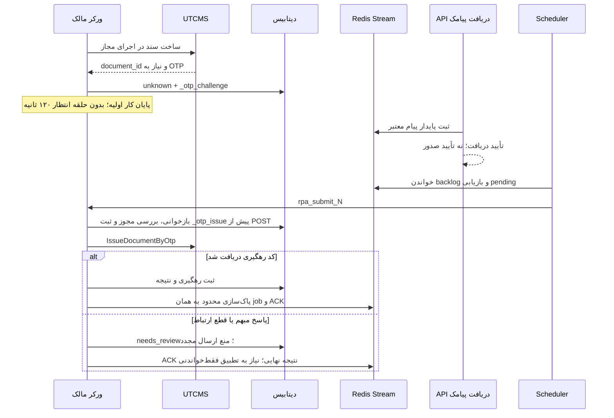

# دریافت پیامک و چرخه OTP در BarPro

> بازنگری: 2026-10-06 — قرارداد کد؛ وضعیت production در این بررسی آزموده نشده است.
> سند پیشین در تاریخچه Git (`6c5564e`) محفوظ است. ادعاهای آن درباره انتظار ۱۲۰ ثانیه، درصد نیاز به OTP، TTL قطعی UTCMS و تضمین کامل قفل، شاهد وضعیت فعلی نیستند.

## جریان کار

پاسخ واقعی UTCMS مشخص می‌کند سند به OTP نیاز دارد یا نه. بازه قابل تنظیم ۱۷:۳۰ تا ۰۸:۰۰ صرفاً پیش‌بینی است. ساخت سند مجاز در مسیر mobile/OTP همچنان به مجوز همان اجرای BarPro نیاز دارد؛ پیش‌فرض `ALLOW_LIVE_SUBMIT=false` حفظ می‌شود.

پیاده‌سازی: `app/automation/waybill_bot_multitenant.py`، `app/services/otp_delivery.py`، `app/services/otp_wakeup_consumer.py`، `app/services/waybill_job_service.py` و `app/workers/tasks.py`.

## راه‌اندازی فورواردر

1. شماره موبایل راننده را در پروفایل او ثبت کنید. در صفحه رانندگان، «راهنمای دریافت پیامک» آدرس مخصوص همان شماره را نشان می‌دهد.
2. برنامه فورواردر باید درخواست `POST` به `/api/v1/otp/sms-forwarder/{driver_phone}` ارسال کند. متن پیام در `content`، سرشماره فرستنده در `from` و زمان دریافت در `timestamp` قابل ارسال است. زمان Unix ثانیه یا میلی‌ثانیه پذیرفته می‌شود.
3. اپراتور مجاز مقدار `OTP_WEBHOOK_SECRET` را در هدر `X-OTP-Webhook-Token` فورواردر وارد می‌کند. `X-Webhook-Token`، `X-Webhook-Secret` و `Authorization: Bearer` نیز پشتیبانی می‌شوند. **توکن در query URL پذیرفته نمی‌شود.** endpoint راهنما هیچ secret برنمی‌گرداند.
4. `HEALTH_CHECK` فقط دسترسی برنامه تا intake را بررسی می‌کند؛ موفقیت آن به معنی وصول پیامک آینده یا صدور سند نیست. بدون secret، intake با 503 و با توکن نادرست با 401 رد می‌شود.
5. در صورت نبود فورواردر، کاربر کد را برای job متعلق به خودش وارد می‌کند. پاسخ `accepted` یعنی کد برای پردازش دریافت شده؛ نتیجه را در تاریخچه همان راننده بررسی کنید.

`GET /api/v1/otp/forwarder-config/{driver_id}` مالکیت راننده، شماره و آمادگی Redis/secret را بررسی می‌کند. `intake_ready` با `forwarder_connection_verified` متفاوت است؛ اتصال گوشی بدون شاهد دریافت معتبر تأیید نمی‌شود. `/health` نیز تنها آمادگی intake را می‌گوید.

شماره مقصد از مسیر، query غیرحساس `driver_phone`، هدر یا بدنه قابل دریافت است. اگر شماره موجود نباشد، فقط یک job معتبر معلق در کل intake مشترک مجوز انتساب می‌دهد. چند job با `422 AMBIGUOUS_OTP` رد می‌شوند. سرشماره فرستنده شماره راننده نیست.

## ماندگاری، ترتیب و هم‌زمانی

- پیام معتبر با Lua در `rpa:otp:stream` و کلید شماره ثبت می‌شود. شکست ذخیره‌سازی، پاسخ 503 می‌دهد. تکرار همان پیام عمر کد را تازه نمی‌کند.
- گروه `barpro_otp_group` از `0` ساخته می‌شود؛ `XAUTOCLAIM` پیام‌های pending رهاشده را بازیابی می‌کند. تحویل قابل تلاش مجدد ACK نمی‌شود؛ پیام‌های منقضی یا دارای نتیجه نهایی ACK و حذف می‌شوند. پیام ACKنشده با محدودسازی طول Stream حذف نمی‌شود.
- پیام به `job_id`، `document_id`، شماره معتبر و زمان challenge متصل است. بازیابی یا تعویض ورکر نباید کد قدیمی را به سند جدید منتقل کند.
- مجوز اجرای اولیه، مالک ورکر و اثر انگشت پراکسی در `_otp_challenge` ثبت می‌شوند. API و Scheduler فقط dispatch می‌کنند؛ صدور روی `rpa_submit_N` همان ورکر و همان egress اجرا می‌شود.
- قفل Redis توکن یکتا دارد؛ TTL اولیه ۳۰ ثانیه و تمدید هر ۱۰ ثانیه است. آزادسازی و تمدید تنها با تطبیق توکن انجام می‌شود. بازخوانی نهایی با قفل ردیف دیتابیس و fence پایدار، فاصله check تا POST را حفاظت می‌کند. رفتار واقعی قفل PostgreSQL باید در CI سرویس‌دار آزموده شود؛ SQLite جای آن را اثبات نمی‌کند.
- `_otp_issue=dispatching/unknown/issued` مانع ارسال دوباره است. هر tracking ذخیره‌شده مستقل از status مانع POST می‌شود. رد صریح UTCMS از نتیجه مبهم جداست.
- `consume_scoped_otp` کلید job و pending آن را حذف می‌کند؛ کلید شماره تنها وقتی حذف می‌شود که هنوز متعلق به همان job باشد. پاک‌سازی job قبلی نباید challenge جدید همان شماره را حذف کند.
- وجود سند OTP حل‌نشده، ساخت سند بعدی برای همان راننده را در ورودی ایجاد job و مسیرهای اجرایی متوقف می‌کند. job فاقد سند واقعی صرفاً به خاطر متن خطا راننده را قفل نمی‌کند.

## زمان‌ها و حدود اعتبار

| داده | قرارداد BarPro |
|---|---|
| پیام ورودی | حداکثر ۳۰۰ ثانیه از `received_at`؛ dispatch عمر تازه نمی‌دهد |
| زمان کلاینت | اعتبارسنجی ثانیه/میلی‌ثانیه و تصحیح محدود اختلاف یک‌ساعته؛ ساعت UTC سرور مرجع مقایسه است |
| کش session سند | ۳۶۰۰ ثانیه در Redis؛ استفاده از توکن نیازمند تطبیق job/document/client/egress است |
| پیام بدون timestamp | برای سازگاری با برخی فورواردرها زمان intake مبناست؛ زمان واقعی ارسال از این پیام قابل اثبات نیست |
| اعتبار کد در UTCMS | در این بررسی زنده اندازه‌گیری نشده؛ TTL محلی تضمین پذیرش بالادست نیست |

کد inline موجود در payload پیش از ایجاد challenge، شاهد پیام تازه نیست و نباید با زمان جدید به کد معتبر تبدیل شود. دریافت کد از مسیر پایدار پس از challenge انجام می‌شود.

## ارتقا و عملیات

- jobهای قدیمی فاقد `_otp_challenge` معتبر خودکار صادر نمی‌شوند. پیش از ارتقای عملیاتی، اسناد معلق باید فهرست و با تطبیق فقط‌خواندنی تعیین تکلیف شوند؛ ساخت مجدد سند یا جعل metadata راه بازیابی نیست.
- API، Scheduler و همه ورکرها باید قرارداد جدید را داشته باشند و `barpro.otp.complete_event` در Workerهای مالک ثبت شده باشد. بررسی صف‌ها، IP ایرانی و deployment خارج از این ممیزی محلی است.
- معیار ثبت بارنامه همان دو شاهد است: tracking پاسخ RPA و همان tracking در `WaybillJob.result_json`. تطبیق History گروهی نیز طبق `docs/UTCMS_CONSTRAINTS.md` انجام می‌شود. تغییر UI، پذیرش OTP یا بسته‌شدن پنجره اثبات ثبت نیست.

## شواهد

- [گزارش ممیزی و اصلاحات](audits/2026-10-06/REPORT.fa.md)
- `tests/test_otp_reliability_regressions.py`: Redis واقعی، بازیابی و مالکیت lease، freshness و fence.
- `tests/test_otp_wakeup_and_lifecycle.py`: مسیر HTTP تا Stream و task ورکر با SQLite و Redis؛ UTCMS و broker خارجی مصنوعی‌اند.
- `tests/test_otp_forwarder_hardening.py`: رد توکن query، مالکیت، آمادگی و config بدون secret.
- `tests/integration/`: آزمون‌های سرویس‌دار؛ نتیجه اجرا و موارد skip در گزارش نهایی ثبت می‌شوند.
