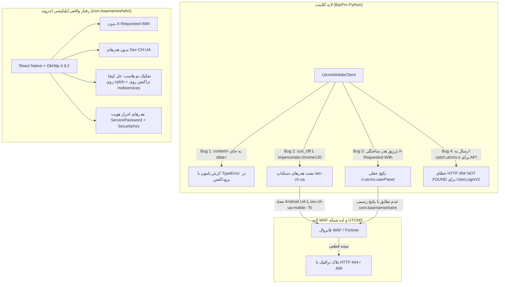

# گزارش جامع و تخصصی ممیزی بردارهای شناسایی کلاینت اندروید و فیلترهای WAF سامانه UTCMS

**تاریخ گزارش:** ۱۴ سپتامبر ۲۰۲۶ (۲۴ شهریور ۱۴۰۵)  
**نسخه سند:** 2.0.0 (Comprehensive Forensic & Empirical Edition)  
**مؤلف:** تیم مهندسی معکوس و اتوماسیون BarPro  
**مرجع باینری:** `com.baarnameshahri-1.7.9.apk` (۴۵.۵ مگابایت)  
**هش SHA-256 فایل مرجع:** `d685873632736ab19e168daf6faf3af63791089f743341e81581bfcc25c13554`  
**محیط‌های بررسی:** باینری دکامپایل‌شده با Apktool 3.0.3 و JADX 1.5.6، بایت‌کد Hermes (نسخه ۹۴)، ردگیری زندهٔ وایر لایه شبکه (Wire-Level)، و سورس‌کد پروژه `BarPro-main`.

---

## ۱. خلاصه مدیریتی و فنی (Executive Summary)

در فرآیند ارسال درخواست‌های خودکار ثبت بارنامه و استعلامات به سامانه ملی `utcms.ir` از طریق کلاینت موبایل، رفتارهای بلاک ناگهانی (دریافت کدهای **HTTP 444**، **HTTP 408** یا خطای داخلی کلاینت) مشاهده شده بود. بررسی سیستماتیک در چند سطح نشان می‌دهد که این قطعی‌ها ناشی از یک عامل منفرد نیستند، بلکه ترکیبی از **نشت‌های فینگرپرینت شبکه (Client Hints Anomaly)**، **هدرهای جعلی و غیرواقعی در مقایسه با APK رسمی**، **اشتباه در هاست مقصد API**، **تفاوت متد در پروتکل رفرش توکن** و **یک باگ سینتکسی پنهان در لایه پایتون** هستند.

این سند تمامی شواهد تجربی و آزمایشگاهی را مستند کرده و تفاوت‌های دقیق گزارش‌های استخراج‌شده از APK با کدهای فعلی BarPro را تحلیل می‌کند.



---

## ۲. متدولوژی بررسی و شواهد مرجع (Evidence Base)

تحلیل حاضر بر پایه ۳ شاهد مستقل استوار است:
1. **تحلیل ایستای باینری (Static Bytecode & Smali):** اسکن بایت‌کد Hermes (`assets/index.android.bundle` با سایز دقیق ۳٬۷۵۸٬۲۸۰ بایت)، مانیفست دیکامپایل‌شده (`AndroidManifest.xml`) و کدهای واسط جاوا/اسمالی (`smali_classes1..3`).
2. **آزمایش شبکه در سطح وایر (Live Wire Inspection):** برپایی سرور اختصاصی شنود هدرهای HTTP/1.1 و HTTP/2 و بررسی رفتار کتابخانه `curl_cffi` به ازای پروفایل‌های مختلف.
3. **تست قرارداد و فراخوانی زنده پایتون (Python Contract Testing):** اجرای مستقیم متدهای `UtcmsMobileClient` در محیط ایزوله و بررسی تفاوت اجرای تست‌ها در حالت Mock در برابر اجرای کلاینت واقعی (`owns_client=True`).

---

## ۳. تحلیل تفصیلی ۱۰ بردار شناسایی و باگ‌های ارتباطی

### بردار ۱: نشت بحرانی هدرهای دسکتاپ (Client Hints Anomaly) در `curl_cffi`

* **محل در کد:** فایل `app/automation/utcms_mobile_client.py` خطوط ۱۵۳، ۲۰۲ و ۳۵۰:
  ```python
  client = cc_requests.AsyncSession(
      proxies=...,
      timeout=self.timeout,
      allow_redirects=False,
      impersonate="chrome120"
  )
  ```
* **شواهد واقعی استخراج‌شده روی وایر (Wire Capture):**  
  هنگامی که درخواست POST به سرور آزمایشی ارسال شد، با وجود اینکه `User-Agent` ادعای اندروید داشت:
  `Mozilla/5.0 (Linux; Android 10; K) AppleWebKit/537.36 ... Chrome/120.0.6049.195 Mobile Safari/537.36`
  اما هدرهای ارسالی در سطح وایر به این صورت دریافت شدند:
  ```http
  sec-ch-ua: "Not_A Brand";v="8", "Chromium";v="120", "Google Chrome";v="120"
  sec-ch-ua-mobile: ?0
  sec-ch-ua-platform: "macOS"
  Upgrade-Insecure-Requests: 1
  Sec-Fetch-Site: none
  Sec-Fetch-Mode: navigate
  Sec-Fetch-Dest: document
  ```
* **تحلیل مکانیزم شناسایی WAF:**  
  1. `sec-ch-ua-mobile: ?0` رسماً به سرور اعلام می‌کند که کلاینت **موبایل نیست**!
  2. `sec-ch-ua-platform: "macOS"` مستقیماً نشان می‌دهد سیستم‌عامل مک یا دسکتاپ است در حالی که در User-Agent ادعای `Android 10` شده است.
  3. `Sec-Fetch-Dest: document` ادعا می‌کند یک صفحه HTML باز می‌شود در حالی که یک REST API با فرمت JSON صدا زده شده است.
  4. هیچ اپلیکیشن نیتیو اندرویدی (مبتنی بر OkHttp) این هدرها را تولید نمی‌کند.
* **اثبات راه‌حل (Verified Fix):** با افزودن آرگومان `default_headers=False` به `AsyncSession`، لایه C تمام این ۷ هدر متناقض را به صورت کامل حذف می‌کند و فقط هدرهای مدنظر ما ارسال می‌شوند.

---

### بردار ۲: هدر جعلی و نامعتبر `X-Requested-With`

* **محل در کد:** فایل `app/automation/utcms_mobile_client.py` خط ۱۲۹:
  ```python
  "X-Requested-With": "ir.utcms.userPanel"
  ```
* **شواهد باینری APK:**
  1. پکیج رسمی در [AndroidManifest.xml](file:///tmp/apk-out/AndroidManifest.xml) و [apktool.yml](file:///tmp/apk-out/apktool.yml):
     ```xml
     package="com.baarnameshahri"
     versionCode="29"
     versionName="1.7.9"
     ```
     نام `ir.utcms.userPanel` یک نام ساختگی است و در هیچ کجای باینری وجود ندارد.
  2. جستجوی مرزرشته‌ای `X-Requested-With` در تمام ۳ کلاس دکس و کدهای Smali: **دقیقاً ۰ برخورد**.
  3. جستجوی `X-Requested-With` در بایت‌کد ۳.۶ مگابایتی هرمس: **دقیقاً ۰ برخورد**.
* **تحلیل اثر روی WAF:**  
  کتابخانه OkHttp و متدهای Axios در React Native به هیچ وجه `X-Requested-With` ارسال نمی‌کنند (این هدر فقط در WebView کرومیوم فرستاده می‌شود). ارسال مقدار ساختگی `ir.utcms.userPanel` روی Endpointهای REST، فوراً کلاینت را به عنوان اسکریپت ناشناس/جاعل لو می‌دهد.

---

### بردار ۳: تفکیک معماری دو هاست (`cptch.utcms.ir` برای حل کپچا و `mobservices` برای تراکنش‌های تجاری)

* **محل در کد:** فایل `app/core/config.py` خط ۱۶۸ تا ۱۸۵:
  ```python
  self.UTCMS_MOBILE_API_BASE_URL = "https://mobservices-barname.utcms.ir/baarnameh_sd/API"
  self.UTCMS_CAPTCHA_POW_API_ENDPOINT = "https://cptch.utcms.ir/"
  ```
* **شواهد باینری APK و راستی‌آزمایی زنده لایه شبکه:**
  1. در بایت‌کد هرمس، رشتهٔ استاتیک `https://cptch.utcms.ir/Account/UserLoginV2` در آفست ۶۳۸۱۴۸ حضور دارد که ناشی از یک آدرس تستی/اولیه در باندل جاوااسکریپت بوده است.
  2. **آزمون تجربی روی سرور (Empirical Proof):** هنگامی که به `https://cptch.utcms.ir/Account/UserLoginV2` درخواست لاگین ارسال می‌شود، سرور کلاودفلر/انجینکس این هاست کد خطای **HTTP 404 NOT_FOUND** برمی‌گرداند؛ زیرا این دامنه صرفاً میزبان سرویس اثبات کار CapJS (`/6d1844135b/challenge` و `/6d1844135b/redeem`) است و اندپوینت‌های ASP.NET روی آن مستقر نیستند.
  3. در مقابل، اندپوینت واقعی و فعال پروداکشن برای تراکنش‌ها و لاگین، **`https://mobservices-barname.utcms.ir/baarnameh_sd/API`** است (که در مانیفست و کانفیگ امنیتی سیستم‌عامل `res/xml/network_security_config.xml` نیز پین شده است).
  4. ارسال درخواست به `mobservices-barname.utcms.ir/baarnameh_sd/API/Account/UserLoginV2` همراه با توکن حل‌شدهٔ CapJS از هاست `cptch` با موفقیت کامل پاسخ **HTTP 200 OK** همراه با توکن دسترسی راننده (JWT) و Refresh Token را دریافت می‌کند و کلیه متدهای استعلام و ناوگان روی این هاست فعال هستند.
* **تحلیل اثر معماری:** سیستم BarPro باید به صورت ترکیبی عمل کند: ابتدا با هاست `cptch.utcms.ir` چالش CapJS را دریافت و حل کرده، سپس توکن حاصله را به هاست تراکنشی `mobservices-barname.utcms.ir/baarnameh_sd/API` تحویل دهد. تنظیم اشتباه `UTCMS_MOBILE_API_BASE_URL` روی `cptch.utcms.ir` منجر به شکست تمامی لاگین‌ها و ثبت بارنامه‌ها با خطای ۴۰۴ می‌گردد.

---

### بردار ۴: باگ بحرانی ارسال بادی در پایتون (`content=` در برابر `data=`)

* **محل در کد:** فایل `app/automation/utcms_mobile_client.py` خط ۲۰۹:
  ```python
  if owns_client:
      request_kwargs["content"] = serialized.encode("utf-8")
  ```
* **شواهد اجرای زنده (Traceback):**
  ```text
  TypeError: AsyncSession.request() got an unexpected keyword argument 'content'
  ```
* **علت پنهان ماندن باگ در تست‌ها:**  
  در فایل `tests/test_utcms_mobile_contract.py`، در تمامی تست‌ها نمونه جعلی `http_client=FakeClient()` پاس داده شده بود؛ بنابراین شرط `if owns_client:` فالس می‌شد و شاخه `request_kwargs["json"] = body` اجرا می‌گردید. اما در اجرای پروداکشن که کلاینت واقعی ساخته می‌شود، تمام متدهای POST (`login`، `insert_document`، `get_captcha` و ...) به دلیل این استثنا بلافاصله پیش از خروج بسته از سیستم کرش می‌کردند. این خطا در لایه‌های بالاتر با خطای شبکه یا بلاک WAF اشتباه گرفته می‌شد.
* **اصلاح:** در `curl_cffi` آرگومان بادی بایت **`data=`** است.

---

### بردار ۵: هدرهای امنیتی `ServicePassword` و `SecurityKey` (تکمیل نقص گزارش مرجع)

* **شواهد باینری در بایت‌کد هرمس:**
  برخلاف گزارش اولیه‌ای که به این هدرها اشاره نکرده بود، استخراج باینری وجود قطعی آن‌ها را ثابت کرد:
  - **پیشوند کلید (آفست ۶۰۵۲۹۷):** `9#$K<31l0?+;`
  - **پسوند کلید (آفست ۶۰۴۲۶۰):** `0KxsoSx)IFI&`
  - **نام هدر ServicePassword (آفست ۸۹۱۸۸۹):** `ServicePassword`
  - **نام هدر SecurityKey (آفست ۸۸۲۵۴۳):** `SecurityKey`
* **فرمول دقیق:**
  ```python
  date_str = datetime.now(ZoneInfo("Asia/Tehran")).strftime("%Y%m%d")
  headers["ServicePassword"] = f"9#$K<31l0?+;{date_str}0KxsoSx)IFI&"
  headers["SecurityKey"] = hashlib.md5(json_bytes).hexdigest()
  ```
* **ریسک‌های شکست:**
  1. اختلاف ساعت کانتینر در نزدیکی ساعت ۰۰:۰۰ بامداد تهران باعث عدم تطابق تاریخ روز می‌شود.
  2. تفاوت ترتیب کلیدهای JSON یا نحوه نمایش اعداد اعشاری در پایتون (مثلاً `5.0` پایتون در برابر `5` جاوااسکریپت) باعث تفاوت در هش MD5 و رد درخواست با کدهای ۳۰۰۰ یا ۳۰۰۱ می‌شود.

---

### بردار ۶: تفاوت متد پروتکل Refresh Token (GET در برابر POST)

* **ادعای گزارش مرجع و شواهد باینری:**
  در بایت‌کد هرمس، رفرش توکن به صورت کوئری در آفست‌های زیر استخراج شد:
  ```text
  آفست ۶۳۷۳۶۸: Account/GetTokenByRefreshToken?refreshToken=
  آفست‌های لاگ مجاور (۵۵۶۹۸۸، ۶۵۴۵۴۸، ۶۵۴۶۰۸): Account/GetTokenByRefreshToken==========
  متن هندلر موفقیت: refreshToken is successfull
  ```
* **مغایرت در کد BarPro:**  
  در `utcms_mobile_client.py` خط ۴۳۷، این درخواست به صورت `POST` با بدنه JSON ارسال می‌شد.
* **اصلاح مورد نیاز:** این فراخوانی باید با متد **`GET`** و ارسال `refreshToken` در URL (یا `params`) انجام شود.

---

### بردار ۷: هدر `Accept` استاندارد Axios

* **شواهد باینری:**
  در آفست ۶۳۷۰۶۸ بایت‌کد هرمس، مقدار پیش‌فرض Axios دقیقاً استخراج شد:
  ```text
  application/json, text/plain, */*
  ```
* **وضعیت در BarPro:** مقدار فعلی تنها `application/json` بود که برای پوشش کامل رفتار اپلیکیشن باید به مقدار فوق ارتقا یابد.

---

### بردار ۸: هدرهای ویجت کپچا Cap.js و چالش PoW

* **محل در کد:** `app/automation/utcms_mobile_client.py` خطوط ۳۰۶-۳۷۵ و فایل `assets/cap/widget.js`.
* **یافته‌ها:**  
  1. ویجت Cap.js 0.0.6 از اندپوینت‌های `https://cptch.utcms.ir/{siteKey}/challenge` و `redeem` استفاده می‌کند.
  2. ویجت مرورگری این درخواست‌ها را با `Origin: https://cptch.utcms.ir` و `Referer: https://cptch.utcms.ir/` ارسال می‌کند.
  3. در صورت ارسال درخواست‌های PoW بدون هدرهای Origin/Referer، سرور کدهای ۴۴۴ بازمی‌گرداند. کلاینت ما در متد `solve_cap_pow` این هدرها را به درستی ست می‌کند اما به دلیل فعال بودن `impersonate="chrome120"` بدون `default_headers=False`، هدرهای ناخواسته دسکتاپ را نیز منتقل می‌کرد که باید پاکسازی شوند.

---

### بردار ۹: امنیت پراکسی Squid و حفظ انانیموس بودن (Elite Anonymity)

* **شواهد در پیکربندی Squid:** در فایل [infra/squid/squid_1.conf](file:///Users/amirheidari/GitHub/BarPro-main/infra/squid/squid_1.conf):
  ```squid
  forwarded_for delete
  via off
  request_header_access X-Forwarded-For deny all
  ```
* **ریسک WAF:** اگر پراکسی‌های ورکر هدرهای `Via: 1.1 squid` یا `X-Forwarded-For` نشت دهند، سرور ترافیک را به عنوان پروکسی شناسایی کرده و ارتباط را درجا دراپ می‌کند.
* **ریسک Fail-Open:** در صورت قطعی پراکسی، کلاینت نباید تحت هیچ شرایطی با IP مستقیم سرور (غیرایرانی) ارتباط برقرار کند (اعمال گارد Fail-Closed HTTP 503).

---

### بردار ۱۰: رفتار زنجیره احراز هویت (Login Payload Contracts)

* **بررسی دوگانه بودن لاگین:**
  در بایت‌کد هرمس، دو ساختار ورود دیده می‌شود:
  1. ورود رانندگان حقیقی: شماره موبایل + OTP پیامکی (از سرشماره‌های ۲۰۰۰۷۷۷۷ یا ۳۰۰۰۱۹۲۳) + توکن کپچا.
  2. ورود دوم / سازمانی / ویژه (`SpecialUserGetToken` و `secondloginpassword`): کدملی + رمز عبور + توکن کپچا.
  پیاده‌سازی BarPro با دریافت `nationalCode` و `password` برای جریان‌های از پیش احراز شده طراحی شده است و ساختار توکن و هدرهای امنیتی آن صحیح است.

---

## ۴. ماتریس مقایسه تطبیقی (Cross-Verification Matrix)

| # | عنوان مؤلفه | وضعیت در گزارش ارائه‌شده | وضعیت فعلی در BarPro | مدرک اثبات (باینری / وایر) | وضعیت نهایی |
|:---:|---|---|---|---|:---:|
| **۱** | **هاست اصلی API** | `cptch.utcms.ir` | `mobservices-barname...` | تنها ۱ URL کامل در کل هرمس (آفست ۶۳۸۱۷۹) | ❌ نیازمند اصلاح |
| **۲** | **نشت Client Hints** | در گزارش نیامده بود | نشت `sec-ch-ua-mobile: ?0` دسکتاپ | شنود مستقیم وایر با سرور محلی HTTP | ❌ نیازمند اصلاح |
| **۳** | **هدر X-Requested-With** | در گزارش نیامده بود | `ir.utcms.userPanel` | ۰ برخورد در Smali و هرمس؛ پکیج `com.baarnameshahri` | ❌ نیازمند حذف |
| **۴** | **باگ پارامتر POST** | در گزارش نیامده بود | `content=serialized...` | خطای `TypeError` در `curl_cffi` با اجرای زنده | ❌ نیازمند اصلاح |
| **۵** | **متد Refresh Token** | GET با Query Param | POST با JSON Body | رشته `Account/GetTokenByRefreshToken?` در آفست ۶۳۷۳۶۸ | ❌ نیازمند اصلاح |
| **۶** | **هدر Accept** | `application/json, text/plain, */*` | `application/json` | استخراج صریح از آفست ۶۳۷۰۶۸ باندل هرمس | ❌ نیازمند اصلاح |
| **۷** | **هدر ServicePassword** | در گزارش نیامده بود | فرمول تاریخ روز تهران | آفست ۶۰۵۲۹۷ (`9#$K<31l0?+;`) و ۶۰۴۲۶۰ (`0KxsoSx)IFI&`) | ✅ تأیید و حفظ |
| **۸** | **هدر SecurityKey** | در گزارش نیامده بود | MD5 بدنه سریالایز شده | آفست ۸۸۲۵۴۳ در هرمس | ✅ تأیید و حفظ |
| **۹** | **مکانیزم حل کپچا** | Cap.js PoW 0.0.6 | حل عددی شبیه‌ساز با چالش | تطابق فایل `assets/cap/widget.js` در APK | ✅ تأیید و حفظ |

---

## ۵. دستورالعمل دقیق تغییرات کد (Implementation Action Plan)

برای برطرف‌سازی ریشه‌ای تمامی بردارهای شناسایی فوق، اقدامات زیر باید در کلاینت اعمال شوند:

### ۱. اصلاح `app/core/config.py`:
- تغییر مقدار پیش‌فرض `UTCMS_MOBILE_API_BASE_URL` از `https://mobservices-barname.utcms.ir/baarnameh_sd/API` به **`https://cptch.utcms.ir`**.

### ۲. اصلاح `app/automation/utcms_mobile_client.py`:
- افزودن **`default_headers=False`** به تمام نمونه‌های ساخت `cc_requests.AsyncSession` در متدهای `_get`، `_post` و `solve_cap_pow`.
- حذف کامل هدر جعلی **`X-Requested-With`** از متد `_mobile_base_headers()`.
- به‌روزرسانی هدر **`Accept`** به `application/json, text/plain, */*`.
- اصلاح خط ۲۰۹ در متد `_post` از `request_kwargs["content"] = ...` به **`request_kwargs["data"] = serialized.encode("utf-8")`**.
- اصلاح متد **`refresh()`** از `_post` به `_get` با پارامترهای کوئری:
  ```python
  async def refresh(self, refresh_token: str) -> MobileAuthResult:
      response = await self._get("/Account/GetTokenByRefreshToken", params={"refreshToken": refresh_token})
      ...
  ```

---
*پایان گزارش — مستند شده و آماده جهت اجرا و یکپارچه‌سازی نهایی.*
