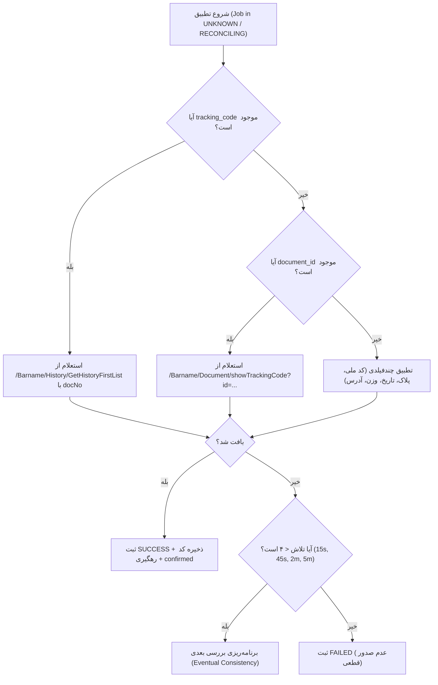

# راهنمای موتور تطبیق و اثبات ثبت بارنامه (UTCMS Reconciliation Guide)

**تاریخ تدوین:** ۱۵ اوت ۲۰۲۶ (۱۴۰۵/۰۵/۲۴)  
**نسخه:** 2.0.0

---

## ۱. اصل غیرقابل مذاکره: قانون اثبات ۳ شاهد (Three-Witness Rule)

هیچ بارنامه‌ای تحت هیچ شرایطی به عنوان `SUCCESS` قطعی ثبت نمی‌شود مگر آنکه هر **سه شاهد** زیر به طور همزمان احراز گردند:

1. **شاهد اول (RPA Proof):** پاسخ استخراج‌شده از مرورگر یا اندپوینت شامل مقدار رشته‌ای معتبر `tracking_code` باشد.
2. **شاهد دوم (Database Persistence):** مقدار `tracking_code` و `request_digest` به همراه وضعیت `mutation_status = "confirmed"` در پایگاه داده ذخیره شود.
3. **شاهد سوم (UTCMS Portal Proof):** سند در جستجوی تاریخچه UTC (`/Barname/History/GetHistoryFirstList`) یا لیست اسناد صادرشده با فیلدهای راننده، پلاک، تاریخ و مبدأ/مقصد کشف و تایید شود.

---

## ۲. استراتژی چندمرحله‌ای تطبیق (Reconciliation Waterfall)

---

## ۳. جدول بازه‌های زمانی بررسی ناهمگام (Eventual Consistency)

| نوبت بررسی | فاصله از ارسال | هدف |
|:---:|:---:|---|
| **تلاش ۱** | ۱۵ ثانیه | بررسی تاخیر شبکه در رندر صفحه نهایی |
| **تلاش ۲** | ۴۵ ثانیه | بررسی صف‌بندی داخلی دیتابیس UTCMS |
| **تلاش ۳** | ۲ دقیقه | رفع تاخیرهای سرویس‌های صدور آنلاین |
| **تلاش ۴ (نهایی)** | ۵ دقیقه | بررسی قطعی نهایی و تعیین تکلیف سند |
