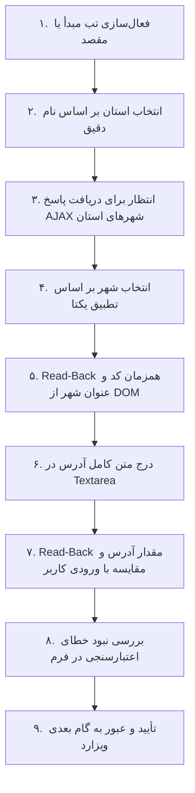

# ماتریس اختصاصی فیلدهای مسیر سامانه UTCMS (Route Field Matrix)

**هدف:** تعریف مرزهای رسمی فیلدهای مسیر در پورتال بارنامه شهری (`barname.utcms.ir`) و حذف کلیه وابستگی‌ها به نقشه و مختصات در حالت `user_text`.

---

## ۱. فیلدهای واقعی و مجاز مسیر

در حالت متنی کاربر (`user_text`)، مسیر بارنامه منحصراً از ۶ فیلد زیر در DOM پورتال تشکیل می‌شود:

### مبدأ (Origin)
```
1. استان مبدأ:   #ddStateSource     (select[name="ddStateSource"])
2. شهر مبدأ:     #ddCitySource      (select[name="ddCitySource"])
3. آدرس مبدأ:    #txtAddressSource  (textarea[name="txtAddressSource"])
```

### مقصد (Destination)
```
4. استان مقصد:   #ddStateDest       (select[name="ddStateDest"])
5. شهر مقصد:     #ddCityDest        (select[name="ddCityDest"])
6. آدرس مقصد:    #txtAddressDest    (textarea[name="txtAddressDest"])
```

---

## ۲. عناصر ممنوع در حالت `user_text` (حذف کامل از چرخه اجرا)

عناصر زیر مربوط به نقشه WebSDK و جستجوی ژئوکدینگ معکوس بوده و در حالت `user_text` **مطلقاً نباید تعامل، جستجو، کلیک یا مقداردهی شوند**:

| عنصر پورتال | وضعیت در حالت متنی | علت ممنوعیت |
|---|---|---|
| `#MapCity` | حذف شده / نادیده گرفته شود | مربوط به انتخاب شهر نقشه map.ir |
| `#MapCity2` | حذف شده / نادیده گرفته شود | مربوط به انتخاب شهر مقصد نقشه |
| `#AddressSearch` | حذف شده / نادیده گرفته شود | ورودی جستجوی متنی نقشه با reverse-geocoding |
| `#AddressSearch2` | حذف شده / نادیده گرفته شود | ورودی جستجوی متنی مقصد نقشه |
| `#txtAddressSourceFromMap` | فیلد Read-Only / ممنوع | آدرس استخراج‌شده از کلیک نقشه |
| `#txtAddressDestFromMap` | فیلد Read-Only / ممنوع | آدرس استخراج‌شده از کلیک نقشه |
| `#SourcePostalCodeFromMap` | فیلد Read-Only / ممنوع | کد پستی استخراج‌شده از نقشه |
| `#destPostalCodeFromMap` | فیلد Read-Only / ممنوع | کد پستی استخراج‌شده از نقشه |
| `#btnsearchAddressSource` | ممنوع | اجرای جستجوی وب‌سرویس نقشه |
| `#btnsearchAddressDest` | ممنوع | اجرای جستجوی وب‌سرویس نقشه |

---

## ۳. ترتیب و استاندارد اجرای انتخاب مبدأ و مقصد در `user_text`



---

## ۴. روش Read-Back و معیار پذیرش فیلدها

| فیلد | متد درج | متد Read-Back از DOM | شرط عبور به مرحله بعد |
|---|---|---|---|
| استان مبدأ / مقصد | `page.select_option("#ddStateSource", value=...)` | `page.eval_on_selector("#ddStateSource", "el => ({ value: el.value, text: el.selectedOptions[0]?.text })")` | `value != ""` و `text` شامل نام استان کاربر |
| شهر مبدأ / مقصد | `page.select_option("#ddCitySource", value=...)` | `page.eval_on_selector("#ddCitySource", "el => ({ value: el.value, text: el.selectedOptions[0]?.text })")` | `value != ""` و `text` شامل نام شهر کاربر |
| آدرس مبدأ / مقصد | `page.fill("#txtAddressSource", address)` | `page.eval_on_selector("#txtAddressSource", "el => el.value")` | `read_back.strip() == user_address.strip()` |

> **قاعده قطعی:** هرگونه عدم تطابق میان مقدار بازخوانی‌شده از DOM با مقدار درخواستی کاربر، یا عدم لود شدن گزینه‌های شهر پس از انتخاب استان، بلافاصله منجر به توقف Job و گزارش خطای صریح می‌گردد.
