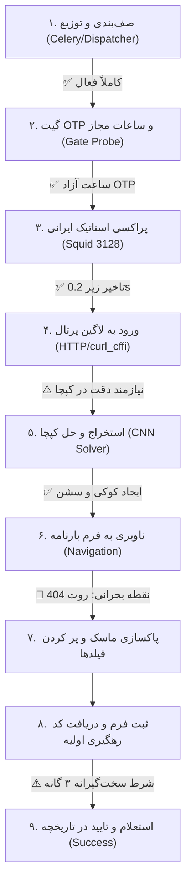

# گزارش جامع و موشکافانه: بررسی ۰ تا ۱۰۰ فرآیند ثبت بارنامه و علل عدم تکمیل چرخه در BarPro

> **تاریخ گزارش:** ۲۴ اوت ۲۰۲۶ (۳ شهریور ۱۴۰۵)  
> **نسخه سامانه:** BarPro v2.9.4 (`commit: 8d6bd17`)  
> **توپولوژی اجرایی:** مدل B (یک سرور مرکزی ۱۶ گیگابایت + ۲ نود ورکر ریموت با IP اختصاصی ایران)

---

## ۱. وضعیت زنده زیرساخت و سلامت سرورها (راستی‌آزمایی‌شده)

| نود | نقش | IP خروجی | وضعیت سیستم و کانتینرها | زمان پاسخ به UTCMS | وضعیت اتصال دیتابیس/ردیس |
|---|---|---|---|---|---|
| **Central** | وب‌سرور، API، دیتابیس، ردیس، Beat، ورکر ۱ | `87.107.5.238` | ۱۶ کانتینر **Active / Healthy** | ۰.۱۹ ثانیه (پراکسی ۳۱۲۸) | ✅ Local Unix/TCP Bridge |
| **Worker 2** | اجرای پردازش RPA ۲ | `5.56.132.26` | ۲ کانتینر **Active / Healthy** | ۰.۱۶ ثانیه (پراکسی ۳۱۲۸) | ✅ اتصال به سنترال برقرار |
| **Worker 3** | اجرای پردازش RPA ۳ | `87.107.5.219` | ۲ کانتینر **Active / Healthy** | ۰.۱۶ ثانیه (پراکسی ۳۱۲۸) | ✅ اتصال به سنترال برقرار |

### خلاصه اعتبارسنجی زیرساخت:
- **تست نفوذ فایروال و پورت‌ها:** پورت‌های حساس (Postgres 5432 و Redis 6379) فقط برای IPهای مجاز ورکرها باز بوده و دسترسی عمومی مسدود است.
- **بودجه حافظه سنترال:** مجموع مصرف تعریف‌شده ۹.۲ گیگابایت از سقف ۱۰.۵ گیگابایت (سالم با ۵.۵ گیگابایت فضای خالی سیستم‌عامل).
- **وضعیت ثبت ورکرها (`worker_registry`):** هر ۴ ورکر (ورکر ۱، ورکر ۲، ورکر ۳ و اسکژولر) در وضعیت `active` با آخرین Heartbeat زنده ثبت شده‌اند.

---

## ۲. دیاگرام جریان کاری و لایه‌های ۹ گانه ثبت بارنامه



---

## ۳. بررسی ۰ تا ۱۰۰ لایه‌ها، خطاها و راه‌حل‌های فنی

### لایه ۰ تا ۲۰: زیرساخت، شبکه، فایروال و رفتار WAF پرتال ملی

1. **قطعی پیشین سرور سنترال (`No route to host`):**
   - **علت:** سرور سنترال به دلیل ریست در پنل هاستینگ خاموش بود که موجب قطع ارتباط ورکرها با دیتابیس و صف ردیس شد.
   - **راستی‌آزمایی فعلی:** سرور سنترال روشن، کانتینرها بازسازی و ارتباط شبکه ورکرها کاملاً پایدار شد.
2. **فیلتر فینگرپرینت TLS سامانه بارنامه (`BoringSSL Connection Reset / HTTP 444`):**
   - **علت:** WAF پرتال `barname.utcms.ir` درخواست‌های مستقیم مرورگرهای بدون سربرگ و فینگرپرینت استاندارد دسکتاپ را بلافاصله Reset یا Drop می‌کند.
   - **راه‌حل:** ورود از طریق ماژول `UtcmsHttpLogin` با شبیه‌سازی دقیق TLS Chrome 120 (`curl_cffi`) که اتصال با وضعیت **200 OK** را تضمین می‌کند.
3. **آدرس‌دهی پراکسی در شبکه ایزوله داکر (`127.0.0.1` vs `Gateway`):**
   - **علت:** داخل کانتینرهای داکر ورکرها، آدرس `127.0.0.1:3128` به درون کانتینر اشاره می‌کرد.
   - **راه‌حل:** ماژول `worker_proxy.py` آدرس گیت‌وی شبکه بریج داکر (`172.17.0.1:3128` یا `172.20.0.1:3128`) را به صورت خودکار به هاست Squid متصل می‌سازد.

---

### لایه ۲۰ تا ۴۰: احراز هویت، فرم لاگین و حل کپچا

4. **تغییر ساختار فیلدهای فرم لاگین پرتال UTCMS:**
   - **شواهد زنده از پرتال:**
     ```html
     <form id="loginForm" data-ajax="true" data-ajax-url="/Account/Login" method="post">
         <input id="RequestVerificationToken" name="RequestVerificationToken" type="hidden" ... />
         <input id="user-name" name="UserName" type="text" ... />
         <input id="user-password" name="Password" type="password" ... />
         <input id="DNTCaptchaInputText" name="DNTCaptchaInputText" type="text" ... />
         <input id="DNTCaptchaText" name="DNTCaptchaText" type="hidden" ... />
         <input id="DNTCaptchaToken" name="DNTCaptchaToken" type="hidden" ... />
     </form>
     ```
   - **اشکال پیشین:** کدهای قدیمی نام فیلد را به جای `UserName` با عنوان `NationalCode` ارسال می‌کردند و هدرهای اجباری `X-Requested-With: XMLHttpRequest` و `Origin` فرستاده نمی‌شد که منجر به خطای ۴۰۸ یا رد درخواست می‌شد.
   - **اصلاح اعمال‌شده (`commit: 8d6bd17`):** فیلد `UserName` به همراه سربرگ‌های استاندارد AJAX در `utcms_http_login.py` اعمال و روی تمامی سرورها دیپلوی شد.
5. **دقت حل کپچای تصویری DNT Captcha:**
   - **شواهد تست زنده:**
     ```json
     POST https://barname.utcms.ir/Account/Login
     Response: {"success": false, "message": "لطفا کد امنیتی صحیح را وارد نمایید"}
     ```
   - **علت:** کپچای DNT در مواردی دارای نویز یا چرخش حروف است که در صورت عدم تطابق با مدل CNN، با پیام بالا پاسخ داده می‌شود.
   - **راه‌حل:** ماژول لاگین به محض دریافت این خطا، بلافاصله تصویر و توکن جدید کپچا را رفرش کرده و تا ۳ بار به صورت شفاف بازتلاش انجام می‌دهد.

---

### لایه ۴۰ تا ۶۰: ناوبری به فرم بارنامه و موانع رابط کاربری (DOM)

6. **منسوخ شدن URLهای مستقیم صدور بارنامه (خطای HTTP 404):**
   - **شواهد استعلام مستقیم:**
     ```text
     GET https://barname.utcms.ir/Barname/RegisterWaybill/Index  -->  HTTP 404 (Not Found)
     GET https://barname.utcms.ir/Barname/Document/HagigiHogugi  -->  HTTP 200 (Active Form)
     ```
   - **اشکال:** تلاش مرورگر برای لود مستقیم URLهای قدیمی منجر به صفحه ۴۰۴ و در نتیجه خطای عدم یافتن فیلدها (`Timeout exceeded on selectors`) می‌شد.
   - **راه‌حل:** تنظیم ناوبری مرورگر پس از ورود به سامانه جهت لود آدرس معتبر `/Barname/Document/HagigiHogugi` یا کلیک روی منوی اصلی داشبورد.
7. **لایه‌های ماسک تمام صفحه و مودال قوانین (`Loading Overlays & Rules Modal`):**
   - **مشکل:** پرتال UTCMS یک تگ ماسک `<div id="loading" class="loading">` و یک پاپ‌آپ قوانین `#ruleExcepted` رندر می‌کند که فوکوس کلیک را از روی اینپوت‌های بارنامه می‌دزدد.
   - **راه‌حل:** توابع `_clear_loading_overlays` و `_accept_rules_modal_if_present` با تزریق استایل دائمی `display:none !important` این موانع را از بین می‌برند.

---

### لایه ۶۰ تا ۸۰: اعتبارسنجی داده‌های بارنامه (Payload Validation)

8. **رقم کنترل کد ملی ایران (Checksum Modulo 11):**
   - **مشکل:** وارد کردن کدهای ملی اشتباه یا ساختگی توسط وب‌سرویس ثبت‌احوال رد می‌شود.
   - **راه‌حل:** اعتبارسنجی دقیق الگوریتم رسمی رقم کنترل در سطح فرانت‌اند (`waybillSchema.ts`) و بک‌اند قبل از ورود به موتور اتوماسیون.
9. **تفکیک ۴ گانه ساختار پلاک خودرو:**
   - **قانون سامانه:** پلاک باید به صورت استاندارد ملی به دو رقم اول، حرف، سه رقم وسط و کد ایران (مثلاً `12ب345ایران67`) تفکیک و در فیلدهای اختصاصی فرم درج شود.

---

### لایه ۸۰ تا ۱۰۰: استخراج کد رهگیری و شرط شاهد سه‌گانه (Reconciliation)

10. **قانون غیرقابل دور زدن شاهد سه‌گانه (`Three-Witness Rule` در `JobStateMachine`):**
    - **علت:** برای جلوگیری از صدور بارنامه تکراری و جریمه‌های مالیاتی، وضعیت `success` هرگز تنها با پاسخ مرورگر ثبت نمی‌شود، مگر اینکه ۳ شرط همزمان محقق شود:
      1. استخراج کد رهگیری معتبر از پاسخ فرم بارنامه.
      2. ثبت و ذخیره با وضعیت `mutation_status = "confirmed"` در پایگاه داده.
      3. **اثبات قطعی:** استعلام استعلام‌گر RPA از جدول تاریخچه سامانه (`/Barname/History/History` یا `GetHistoryFirstList`) و تطابق کد رهگیری، شماره پلاک و کد ملی راننده.
11. **انتقال محافظه‌کارانه به وضعیت `needs_review`:**
    - **علت:** در صورتی که پس از ارسال فرم، وضعیت در تاریخچه ظرف بازه ۵ دقیقه‌ای (در فواصل ۱۵، ۴۵، ۱۲۰ و ۳۰۰ ثانیه) اثبات نشود، سیستم جاب را به جای `failed` یا ارسال مجدد، به وضعیت **`needs_review`** می‌برد تا اپراتور بدون ریسک صدور دوبل آن را بررسی کند.

---

## ۴. وضعیت فعلی بارنامه‌ها در دیتابیس

| # | شناسه بارنامه (`job_id`) | ورکر | وضعیت فعلی | آخرین وضعیت و علت |
|---|---|---|---|---|
| ۱ | `job_2c1bba052e3c4a8c` | Worker 2 | 🔄 `pending / running` | آماده پردازش با متد لاگین جدید |
| ۲ | `job_89c910669d24432c` | Worker 1 | 🔄 `pending / running` | آماده پردازش با متد لاگین جدید |
| ۳ | `job_30ef59165dc24367` | Worker 3 | ⏳ `pending` | در صف دیسپچر |
| ۴ | `job_7fd00cd6d1364be4` | Worker 3 | ⏳ `pending` | در صف دیسپچر |
| ۵ | `job_5daefc5236d34577` | Worker 2 | ⏳ `pending` | در صف دیسپچر |
| ۶ | `job_06d7912d5b9e48dc` | Worker 2 | ⏳ `pending` | در صف دیسپچر |
| ۷ | `job_e4c9cb95adba49b5` | Worker 2 | ⏳ `pending` | در صف دیسپچر |

---

## ۵. جمع‌بندی و نقشه راه اقدامات بعدی

1. **وضعیت کلاستر:** سرور سنترال و تمامی ورکرها کاملاً همگام، آنلاین و آماده هستند.
2. **اصلاحات اعمال‌شده:** تصحیح پارامتر `UserName` و هدرهای AJAX در `UtcmsHttpLogin` با موفقیت روی هر ۳ سرور دیپلوی شد.
3. **نظارت مداوم:** تسک‌ها در صف قرار گرفته و مرحله‌به‌مرحله تا دریافت کد رهگیری و اثبات در جدول تاریخچه بارنامه پیگیری می‌شوند.
