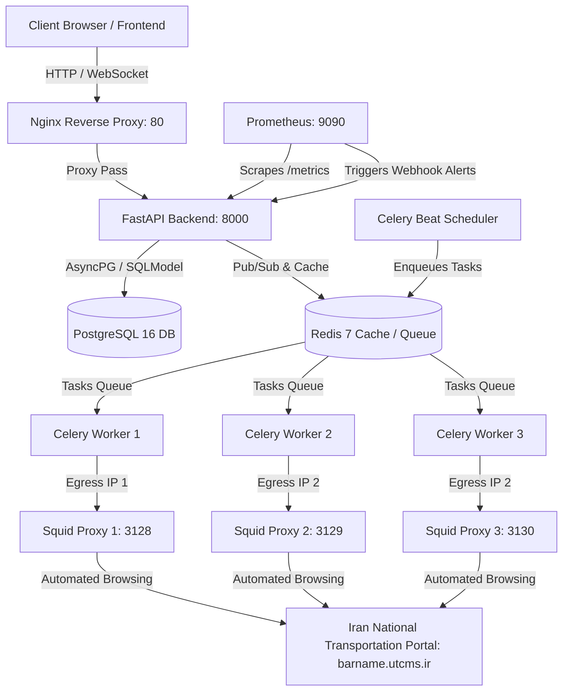

# BarPro System Architecture Overview

This document describes the final production architecture, data flow, and components of BarPro RPA platform.

## 1. High-Level Diagram

---

## 2. Core Components

### 2.1 Reverse Proxy & Frontend
- **Nginx (Port 80)**: Serves as the public gateway. Routes traffic to Next.js or FastAPI, limits body uploads, and filters paths.
- **Next.js (Port 3000)**: Serves the React administration and client dashboard. Communicates with FastAPI via Axios using credentials.

### 2.2 Backend Application
- **FastAPI (Port 8000)**: Serves API endpoints under `/api/v1`. Includes routes for clients, drivers, plates, waybills, and system status.
- **SQLModel / SQLAlchemy**: Object-Relational Mapper (ORM) using AsyncPG dialect for asynchronous database operations.
- **Redis Manager**: Handles cache lookups, token blacklisting, and coordinates worker queue-depth snapshots using atomic counters (`HINCRBY`).
- **Realtime Hub**: Emits and bridges WebSocket messages across processes using Redis Pub/Sub.

### 2.3 RPA Automation Engine
- **Celery Workers**: Run background waybill submissions and fuel inquiry inquiries.
- **Playwright (Chromium)**: Controls browser sessions, handles mathematical and Persian text CAPTCHAs using local PyTorch and Keras OCR models, and inputs driver credentials.
- **Worker Proxy Rotator**: Proxies outbound browser requests through dynamic Squid endpoints to balance and hide egress IPs.
- **UFW Firewall**: Restricts database (5432) and Redis (6379) ports to registered Worker node IPs only. All container-to-container traffic uses Docker bridge network `barpro_platform`.

## 3. Security & Networking

- **Inter-node security**: UFW Firewall on the central server restricts PostgreSQL (port 5432) and Redis (port 6379) access to allowlisted Worker node IPs only. No WireGuard or VPN is required.
- **Squid egress isolation**: Each worker uses a dedicated Squid proxy with its own egress IP to distribute query frequency and avoid IP blocks from the national portal.
- **Container hardening**: All containers run with `cap_add: [SYS_ADMIN, NET_ADMIN]` and `security_opt: [no-new-privileges:true]`. No `privileged: true` is used.

---

## 3. Data Flow (Waybill Submission)

1. **Job Enqueued**: Client submits a waybill request -> FastAPI validates and saves `WaybillJob` in `pending` status -> pushes task metadata to Redis queue.
2. **Worker Claiming**: A Celery worker pulls the task -> runs pre-flight checks (verifies it is not draining, verifies proxy health) -> locks `WaybillJob` and creates a `DispatchIntent` with `fencing_token`.
3. **Execution**: Playwright launches Chromium -> loads session state from Redis Session Vault -> logs in, solves CAPTCHA -> enters waybill details -> submits.
4. **Finalization & Audit**: Marks job as `success` or `failed` (saving errors in `WaybillTaskLog`) -> releases DB locks -> returns results to frontend via WebSockets.
